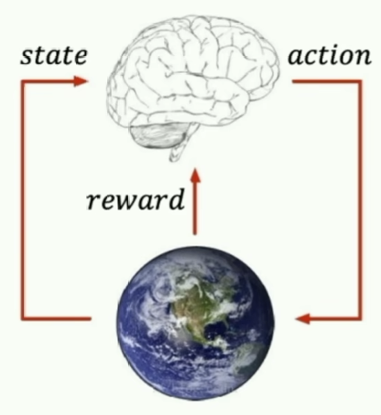
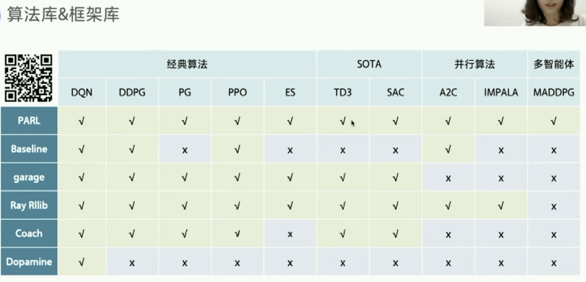
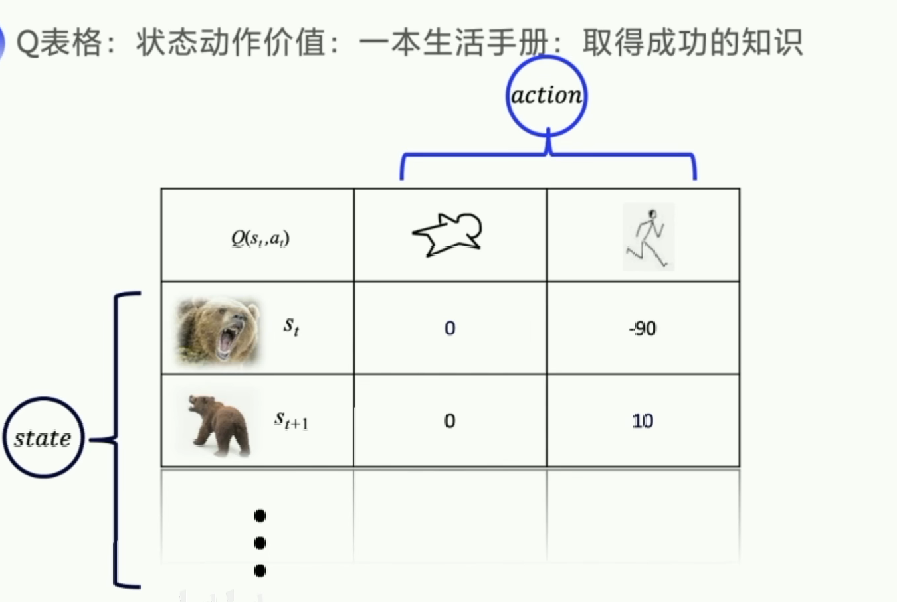
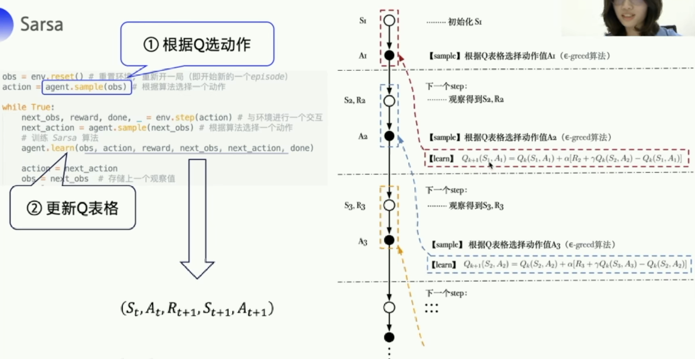
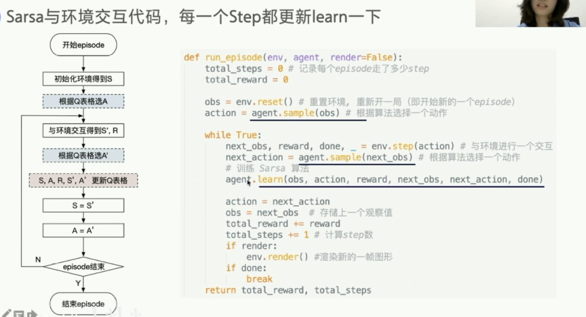
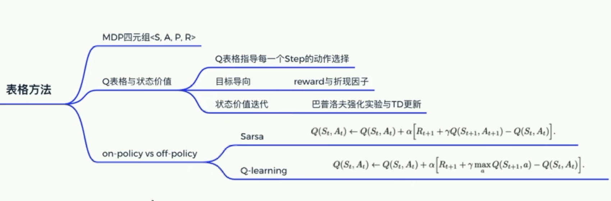

## RL

### 1 What

两部分
- agent
- environment

三要素
- state / observation
- action
- reward

试错探索
利用旧经验

两种学习方案
- 基于价值 value-based
  - 确定性策略：Sarsa、Q-learning、DQN
- 基于策略 policy-based
  - 随机性策略

分类
- （环境是否已知）
- 基于模型（model-based）
- 无模型（model-free）
  - （学习目标）
  - 基于价值
    - （学习方式）
    - on-policy
    - off-policy
  - 基于策略

算法库 & 框架库

RL编程实践（环境）：GYM
Gym：仿真平台、python开源库、RL测试平台
https://gym.openai.com

### value-based

### 2 表格型方法求解RL

RL MDP(马尔可夫决策过程)四元组<S, A, P, R>
- s:state
- a:action
- r:reward
- p:probability 状态转移概率

P函数
R函数

Model-based：P、R函数已知（动态规划）
Model-free：P、R函数未知（RL）

价值 Q函数

#### SARSA（St、At、Rt+1、St+1、At+1）

`value-based`:用下一步一定要执行的动作优化q表格 `on policy`

**`下一步的Q值更新上一步的Q值`**

#### off-policy（St、At、Rt+1、St+1）

### 3 基于神经网络方法求解RL

RL -> Deep RL：从少量状态到数不清的状态

值函数近似：用函数近似Q表格
