防卫式保护头

    #ifndef xxx
    #define xxx


    #endif

# 3 构造函数

### 1 inline函数


### 2 access level(访问级别)
- public
- private：不被外界直接访问
- protected：跟后代（继承）有关


### 3 构造函数
**默认实参，有默认实参的构造函数和无参默认构造函数不能同时存在**

构造函数初始值列表（这个阶段属于初始化、设初值，运行开销有别）

不带指针的类多半不用写**析构函数**    string的例子


# 4 参数传递与返回值

### 1 常量成员函数：不改变类内部成员


### 2 值传递&引用传递

尽量使用引用传递，根据情况是否加const限制


### 3 返回值传递

1. 值传递&引用传递
2. 尽量使用引用传递


### 4 友元（friend）

对比public的get、set函数，友元函数可以直接访问，避免函数开销

但是，一般set、get函数可以设成内联函数，该怎么比较不同？？？

-相同class的各个objects互为friends

### 5 设计类

- 数据设为private
- 使用构造函数**初始值列表**
- 参数尽量使用引用传递，看情况加**const**，设为常量成员函数
- 返回值尽量引用传递：函数内部的局部变量不能引用传递，传出去之后，局部变量销毁 


# 5 操作符重载与临时对象

## 操作符重载-1 成员函数

## 操作符重载-2 非成员函数

临时对象：return typename(params) 返回值就不能是值传递，因为临时对象下一句就销毁


# 6 复习complex类的实现过程

- 防卫式编程头
- 类的声明
- 私有数据
- 构造函数、构造函数初始值列表
- 成员函数（操作符重载、get函数、const函数、友元函数/类）
- 成员函数值传递、引用传递
- 返回值使用引用传递可以使用 obj.X().X() 操作

**question：c++没有set函数吗？？？？**


# 7 拷贝构造、拷贝复制、析构

**class with pointer members**

拷贝构造、拷贝复制 没写的话，编译器自动生成

#### *针对带有私有指针的类，需要自己写**拷贝构造**和**拷贝赋值***

- 拷贝构造 String(const String& str);
```c++
#include<iostream>
using namespace std;
class Complex{
public:
    double real, imag;
    Complex(double r,double i){
        real = r; imag = i;
    }
    // const 版本
    Complex(const Complex & c){
        real = c.real; imag = c.imag;
        cout<<"Copy Constructor called"<<endl ;
    }
    // 非 const 版本
    Complex(Complex & c){
        real = c.real; imag = c.imag;
        cout<<"Copy Constructor called"<<endl ;
    }
};

int main(){
    Complex cl(1, 2);
    Complex c2 (cl);  //调用复制构造函数
    cout<<c2.real<<","<<c2.imag;
    return 0;
}
```
- 拷贝赋值 String& operator= (const String& str); 一定要在操作符=重载中进行**自我检测**，否则如果两个指针指向同一对象，会造成对象丢失（因为要先清空拷贝的对象）
- 析构函数：~String(); 类的对象死亡的时候会被调用


#### 拷贝构造函数被调用的三种情况
#### 三种情况均为 “构造” --- 即 “初始化”
1. 当用一个对象去初始化同类的另一个对象时，会引发复制构造函数被调用。
```c++
ClassA a(b);
ClassA a = b;
```
2. 函数参数传递，作为形参的对象，是用复制构造函数初始化
```c++
#include<iostream>
using namespace std;
class A{
public:
    A(){};
    A(A & a){
        cout<<"Copy constructor called"<<endl;
    }
};

void Func(A a){ }

int main(){
    A a;
    Func(a);
    return 0;
}

// 理解
class 形参 = 实参，其实就是第一种情况
```
3. 作为函数返回值的对象是用复制构造函数初始化的，而调用复制构造函数时的实参，就是 return 语句所返回的对象
```c++
#include<iostream>
using namespace std;
class A {
public:
    int v;
    A(int n) { v = n; };
    A(const A & a) {
        v = a.v;
        cout << "Copy constructor called" << endl;
    }
};

A Func() {
    A a(4);
    return a;
}

int main() {
    cout << Func().v << endl;
    return 0;
}

// 理解
class 返回值 = 函数内部的返回值，其实也是第一种情况
```


# 8 堆、栈与内存管理

- 栈：每一个作用域的所有参数、变量都属于这块内存空间
- 堆（heap）：new关键字，**动态**开辟的内存空间，需要手动清除，避免**内存泄漏**
- static对象，其生命在作用域结束之后仍然存在，直到整个程序结束
- global objects，其生命在整个程序结束之后才结束，作用域是**整个程序**


以String为例：

- new：先分配memory，再调用ctor。operator new分配实际调用c语言的malloc()

- delete：先调用dtor（析构函数）（删除动态分配的内存），再释放内存（杀掉自身）。operator delete内部实际调用free()


## 图例解释

1. 动态分配所得的内存块

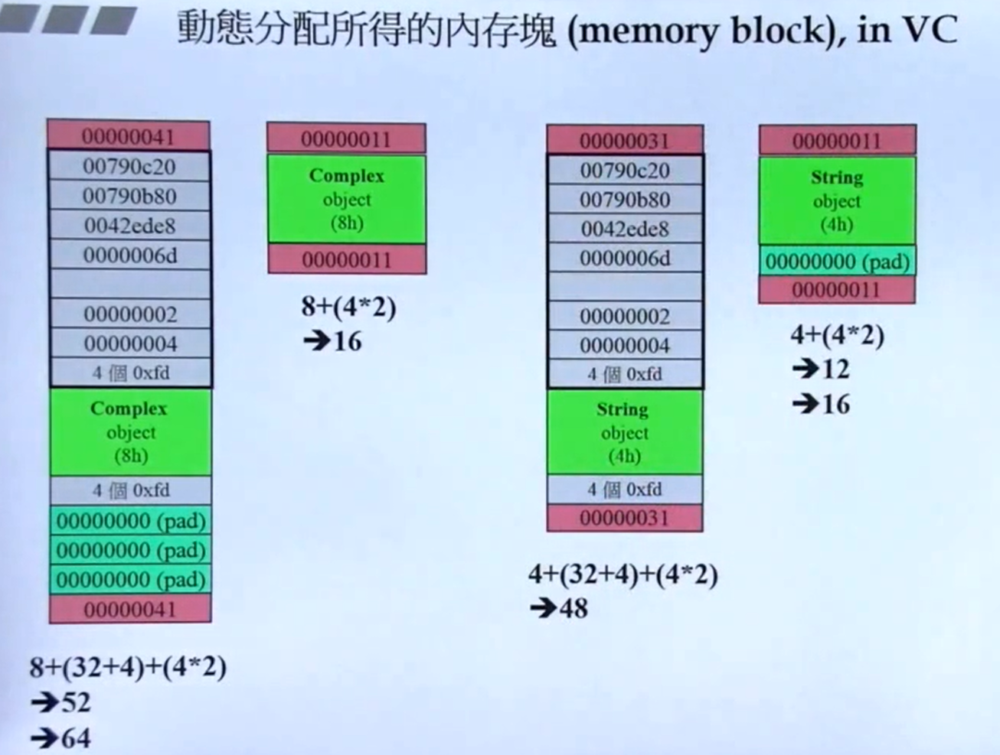


2. 动态分配多个

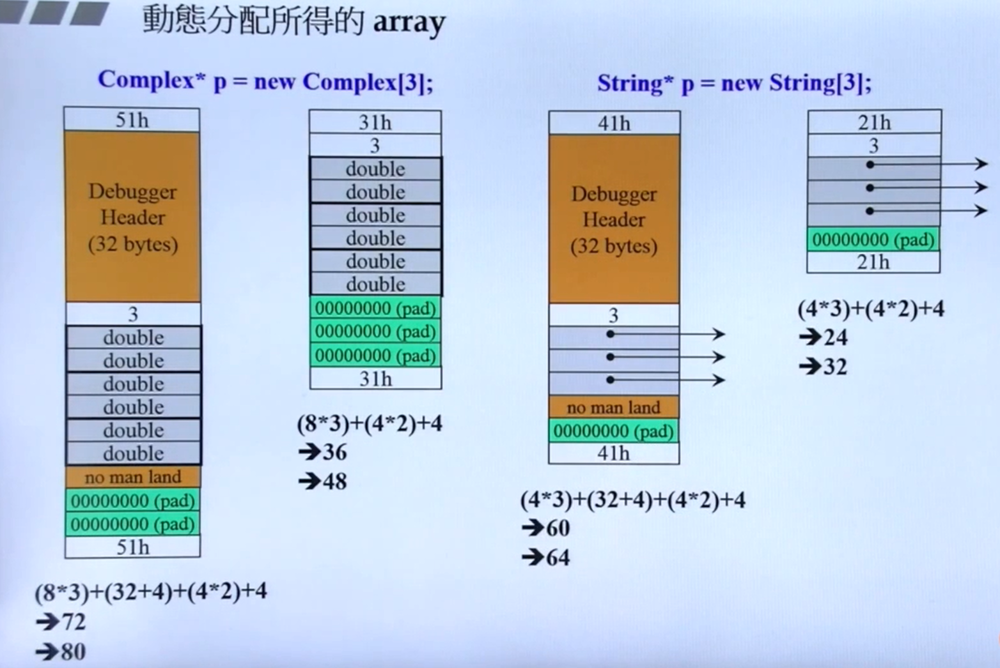

3. array new 搭配 array delete ：避免造成分配的指针数组里面的指针动态分配的那一部分内存泄露


# 需要补充第8节的图

# 9 复习String类的实现过程

- 私有数据：字符指针
- 构造函数
- 拷贝构造函数
- 拷贝赋值函数（首先考虑是不是自我赋值，即是不是同一个地址）
- 析构函数（考虑到class with pointer members）
- 其他函数 get_c_str()


# 10 扩展补充：类模板、函数模板、及其他

## static

- 非静态成员函数仅有一份，通过隐式参数this，指向调用者的指针，来确定访问哪一份非静态数据
- 静态数据仅有一份，没有this这个隐式参数
- 静态函数通过 1）object 调用；2）通过 class name 调用
- **静态数据需要在class的声明外进行定义，定义不需要static关键字**


## cout

重载


## class template 类模板

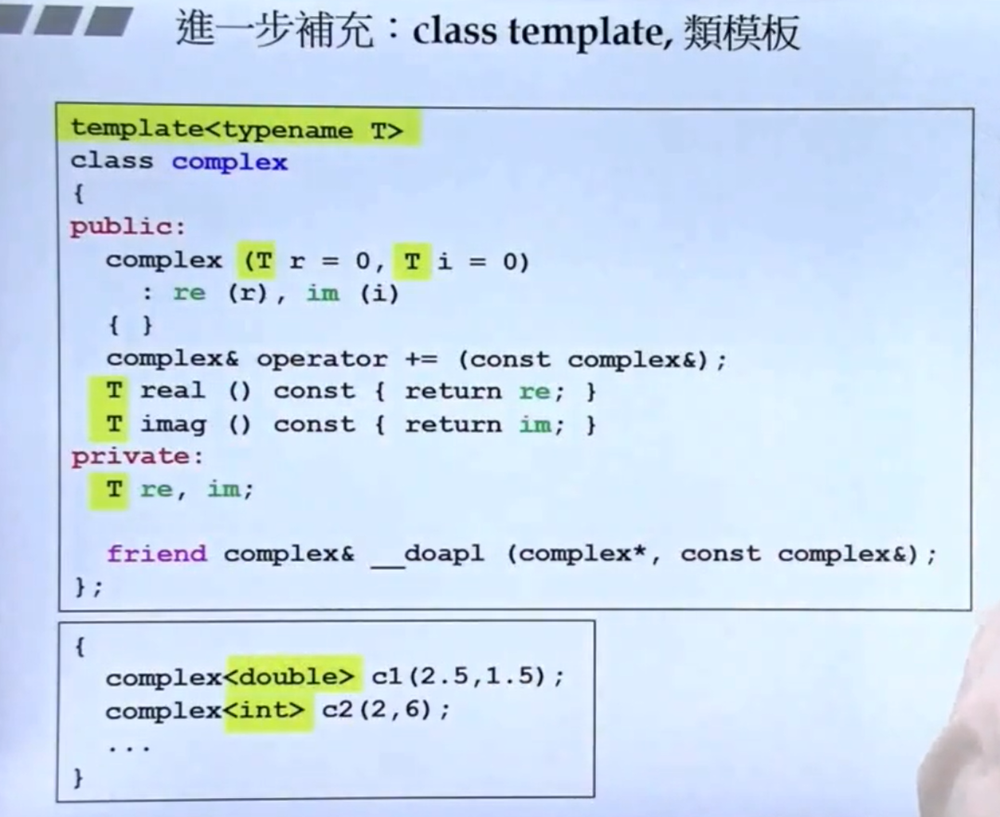


## function template 函数模板


## namespace

```c++
namespace std {

}
```

使用方式

```c++
using namespace xxx
using xxx::xxx
```


# 11 OOP：组合、继承

  composition 组合：has-a

  delegation 委托：composition by reference
  
  inheritance：is-a

```c++
class B : public Class A {

}
```

# 12 虚函数与多态

### 虚函数

> non-virtual函数：不希望 derived class 重新定义（override）
> virtual函数：希望 derived class 重新定义，已有默认定义
> pure virtual函数：希望derived class 一定要重新定义，对其没有默认定义，但是可以有


```c++
virtual void draw() const = 0;  // pure virtual
virtual void error(const std::string& msg); // impure virtual
int objectID() const;   // non-virtual
```


# 13 委托相关设计


# c++程序设计（下）

- 泛型编程
- OOP


# 2 conversion function（转换函数）

### 仅有转换函数

```c++
class Fraction
{
public:
    Fraction(int num, int den = 1): m_numberator(num), m_denominator(den) {}
    operator double() const {
        return (double) (m_numberator / m_denominator);
    }
private:
    int m_numberator;
    int m_denominator;
};

Fraction f(3, 5);
double d = 4 + f;
```


# 3 non-explicit-one-argument ctor

### 1. 仅有 non-explicit-one-argument ctor

```c++
class Fraction
{
public:
    Fraction(int num, int den = 1): m_numberator(num), m_denominator(den) {}
    Fraction operator + (const Fraction& f) {
        return Fraction(...);
    }
private:
    int m_numberator;
    int m_denominator;
};

Fraction f(3, 5);
// 构造函数可以把 int 类型的 4 转换为 Fraction
// 有类似转换函数的作用
Fraction d = 4 + f;
```

### 2. non-explicit-one-argument ctor和转换函数共存

```c++
class Fraction
{
public:
    Fraction(int num, int den = 1): m_numberator(num), m_denominator(den) {}
    operator double() const {
        return (double) (m_numberator / m_denominator);
    }
    Fraction operator + (const Fraction& f) {
        return Fraction(...);
    }
private:
    int m_numberator;
    int m_denominator;
};

Fraction f(3, 5);
// [Error] ambiguous
Fraction d = 4 + f;
```

### 3. explict 明确的

`explict` 大部分用在构造函数前面，模板也用到一点点s

**那么不指明 `explict` 的话，在代码中，可能将其他类型通过构造函数转换为该类型。**

```c++
class Fraction
{
public:
    explict Fraction(int num, int den = 1): m_numberator(num), m_denominator(den) {}
    operator double() const {
        return (double) (m_numberator / m_denominator);
    }
    Fraction operator + (const Fraction& f) {
        return Fraction(...);
    }
private:
    int m_numberator;
    int m_denominator;
};

Fraction f(3, 5);
// [Error] conversion from 'double' to 'Fraction' requested
Fraction d = 4 + f;
```


# 4 pointer-like classes

### 智能指针

```c++
template<class T>
class shared_ptr
{
public:
    T& operator*() const { return *px; }
    T* operator->() const { return px; }

    shared_ptr(T* p) : px(p) {}

private:
    T* px;
    long* pn;

}


struct Foo
{
    ......
    void method(void) { ...... }
}

shared_ptr<Foo> sp(new Foo());
Foo f(*sp);

// 相当于px->methods，虽然->已经被用到了，但是->自动再生成一个->
sp->method();
```

**// 相当于px->methods，虽然->已经被用到了，但是->自动再生成一个->**

### 迭代器

**在智能指针上有改动**


# 5 function-like class 仿函数

重载 operator()

```c++
// 重载 () 之后，A是一个对象
ClassA A;
A(args);

```


# 6 namespace

避免冲突，使用命名空间

```c++
namespace xxx
{
    functions
    variables
}
```


# 7 class template


```c++
template<typename T>
class complex
{
public:
  complex (T r = 0, T i = 0) : re(r), im(i) {}
  complex& operator += (const complex&);
  T real() const { return re; }
  T imag() const { return im; }

private:
  T re, im;

  friend complex& __doapl(complex*, const complex&);
};


int main()
{
  complex<double> c1(2.5, 1.5);
  complex<int> c2(2, 6);

  return 0;
}
```


# 8 function template

函数直接调用，不需要指定T

```c++
template<class T>
inline
const T& min(consot T& a, const T& b)
{
    return b < a ? b : a;
}
```


# 9 member template 成员模板

***支持向上转型***

> - 非模板类的成员模板

p595有例子

> - 模板类的成员模板


    


# 10 specialization 模板特化 全特化


泛化 --> 抽象、模板

特化 --> 具体到某种情况

```c++
template <class Key>
struct hash {};

// 特化
template<>
struct hash<char> {
    size_t operator() (char x) const { return x; }
};

struct hash<int> {
    size_t operator()(int x) const { return x; }
};

struct hash<long> {
    size_t operator()(long x) const { return x; }
};


int main() {
    // 临时对象 hash<long>()
    cout << hash<long>()(1000);
    return 0;

}
```


# 11 模板偏特化 局部特化

> 1. 个数上的偏

```c++
template<typename T, typename Alloc=...>
class vector
{
    ...;
};

template<typename Alloc=...>
class vector<bool, Alloc>
{

};
```


> 2. 范围上的偏

```c++
template<typename T>
class C
{
    ...;
};

// 范围偏特化，类型为指针，也即范围偏特化
// 指明可以是指针，可以是任意类型的指针，所以算是偏特化，如果指明是某一类型的指针，那就是全特化了
template<typename T>
class C<T*>
{
    ...;
};

int main()
{
    // 使用全泛化版本
    C<string> obj1;
    // 使用范围不同（类型为指针）的偏特化版本
    C<string*> obj2;
}
```


# 12 template template parameter 模板模板参数

因为历史遗留因素，在template之后跟着尖括号中`typename`和`class`相同

`template<typename T>`和`template<class T>`一致

```c++
template<typename T, template<typename T> class Container>
class XCls
{
private:
    Container<T> c;
public:
    ...
};

template<typename T>
using Lst = list<T, allocator<T>>;
```


# 13 关于c++标准库

- 容器（数据结构）
- 算法


# 14 三个主题（c++11 新特性）

### 选讲 3 个

> **1. variadic tempalte （数量不变的模板参数）**

可以是：
- 模板参数包
- 函数参数包
- 函数参数类型包

```c++
template<typename T, typename... Types>
void print(const T& firstArg, const Types&... args)
{
    cout << firstAgr << endl;
    // 这里递归处理args，直至args为0，调用void print() {}
    print(args...);

    // Insise variadic templates, sizeof...(args) yields the number of arguments
    sizeof...(args)
}

// 直至args为0，调用void 
void print()
{

}
```

> **2. auto**

```c++
// method1
list<string> c;
...
list<string>::iterator ite;
ite = find(c.begin(). c.end(), target);

// method2
list<string> c;
...
auto ite = find(c.begin(). c.end(), target);
```


> **3. ranged-base for**

```c++
vector<double>  vec;
...
// 值
for (auto elem : vec)
{
    cout << elem << endl;
}

// 引用
for (auto& elem : vec)
{
    elem *= 3;
}
```


# 15 reference 引用


主要用途

 参数传递
 返回值传递


`注意:`

```c++
double imag(const double& im) {}

double imag(const double im) {}
```

**两者的 `signature` 一致，二者不能同时存在，是否为常量成员函数也是 `函数签名` 的一部分。**

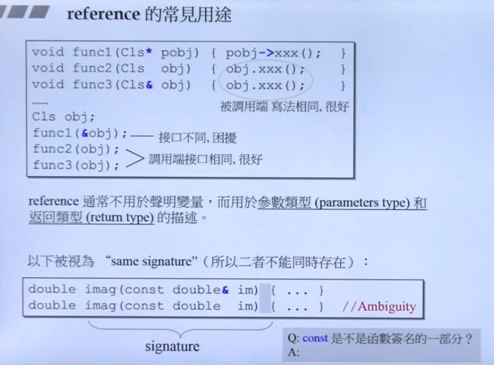


# object model


# 16 复合&继承关系下的构造和析构

### g++编译器：

先父类，再组合类，再自身

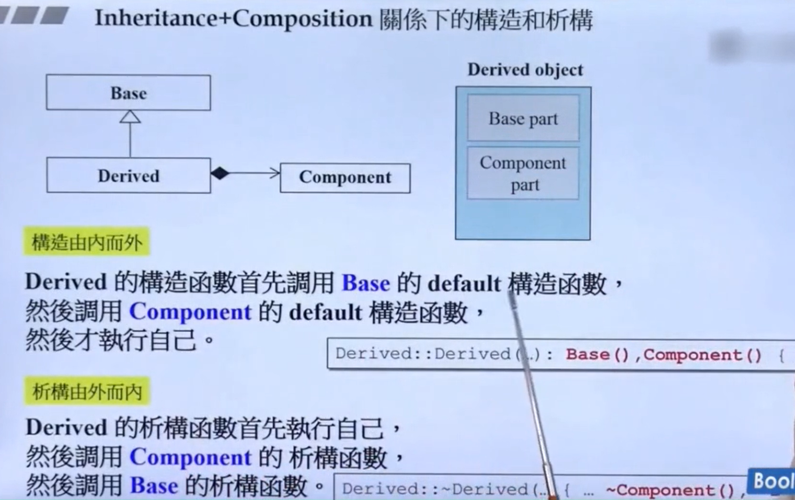


# 17 vptr&vtbl 虚指针、虚表

有虚函数就有虚指针，指向虚函数地址


1. call(xxx) xxx为地址 静态绑定 

2. 调用，虚指针 ---> 虚表 ---> 通过指针调用  动态绑定

动态绑定：
- 由指针调用
- 指针向上转型
- 调用虚函数

// n虚函数再表中第几个
(*(p->vptr)[n])(p);
// 或
(*p->vptr[n])(p);


如右下角例子（`多态`），list<A*> myLst，myLst中元素可以为A、B、C的指针，指向B、C的指针将向上转型。如果myLst容器中不是指针，因为不同对象的大小不一，那么无法同时将A、B、C等多种对象放入，而指针大小为 4 个字节，也通过向上转型转化，调用虚函数时，通过虚指针 ---> 虚表 ---> 确定函数 来动态调用，而不是静态调用


### 解释一：

***怎么理解绑定？***

当函数名被调用时，编译器将选择应该执行的代码，此时即称编译器绑定了函数名。换句话说，当函数被调用时，编译器就会将该该函数的名称和它的定义绑定在一起。

***静态绑定&动态绑定***

静态绑定发生在编译时，并将名称绑定到一个固定的函数定义，然后在每次调用该名称时执行该定义。

在静态绑定中，编译器使用编译时可用的类型信息。如果代码在继承层次结构中的不同类的对象上运行，则编译器可用的唯一类型信息将是用于访问所有对象的基类指针类型。因此，静态绑定将始终使用基类版本的成员函数。

相反，动态绑定发生在运行时。动态绑定仅在编译器可以确定运行时子类对象所属的确切类时才起作用。编译器然后使用这个运行时类型信息来调用该类中定义的函数版本。

为了使动态绑定成为可能，编译器将运行时类型信息存储在具有虚函数的类的每个对象中。动态绑定始终使用对象的实际类中的成员函数版本，而无视用于访问对象的指针的类。


### 解释二:

1. 对象的静态类型：对象在声明时采用的类型。是在编译期确定的。
2. 对象的动态类型：目前所指对象的类型。是在运行期决定的。对象的动态类型可以更改，但是静态类型无法更改。
关于对象的静态类型和动态类型，看一个示例：

```c++
class B
{
}
class C : public B
{
}
class D : public B
{
}
D* pD = new D();//pD的静态类型是它声明的类型D*，动态类型也是D*
B* pB = pD;//pB的静态类型是它声明的类型B*，动态类型是pB所指向的对象pD的类型D*
C* pC = new C();
pB = pC;//pB的动态类型是可以更改的，现在它的动态类型是C*
```

3. 静态绑定：绑定的是对象的静态类型，某特性（比如函数）依赖于对象的静态类型，发生在编译期。
4. 动态绑定：绑定的是对象的动态类型，某特性（比如函数）依赖于对象的动态类型，发生在运行期。

### ***只有虚函数才使用的是动态绑定，其他的全部是静态绑定。***
### ***这句话中 虚函数 这个条件和侯捷老师课程中提到的指针调用、向上转型、调用虚函数相呼应***


### 特别需要注意的地方

当缺省参数和虚函数一起出现的时候情况有点复杂，极易出错。我们知道，虚函数是动态绑定的，但是为了执行效率，缺省参数是静态绑定的。

```c++
class B
{
 virtual void vfun(int i = 10);
}
class D : public B
{
 virtual void vfun(int i = 20);
}
D* pD = new D();
B* pB = pD;
pD->vfun();
pB->vfun();
```


有上面的分析可知pD->vfun()和pB->vfun()调用都是函数D::vfun()，但是他们的缺省参数是多少？
分析一下，缺省参数是静态绑定的，pD->vfun()时，pD的静态类型是D*，所以它的缺省参数应该是20；同理，pB->vfun()的缺省参数应该是10。编写代码验证了一下，正确。
对于这个特性，估计没有人会喜欢。所以，永远记住：
“绝不重新定义继承而来的缺省参数（Never redefine function’s inherited default parameters value.）”


# 18 `this` 指针


右下角例子，传入指向 `调用者的指针` 给成员函数；再到左上角， `this->Serialize()`， 也即 `(*(this->vptr)[n])(this)` ，走的就是第 `17` 节的内容 。至于怎么理解这一句，且听下节动态绑定。

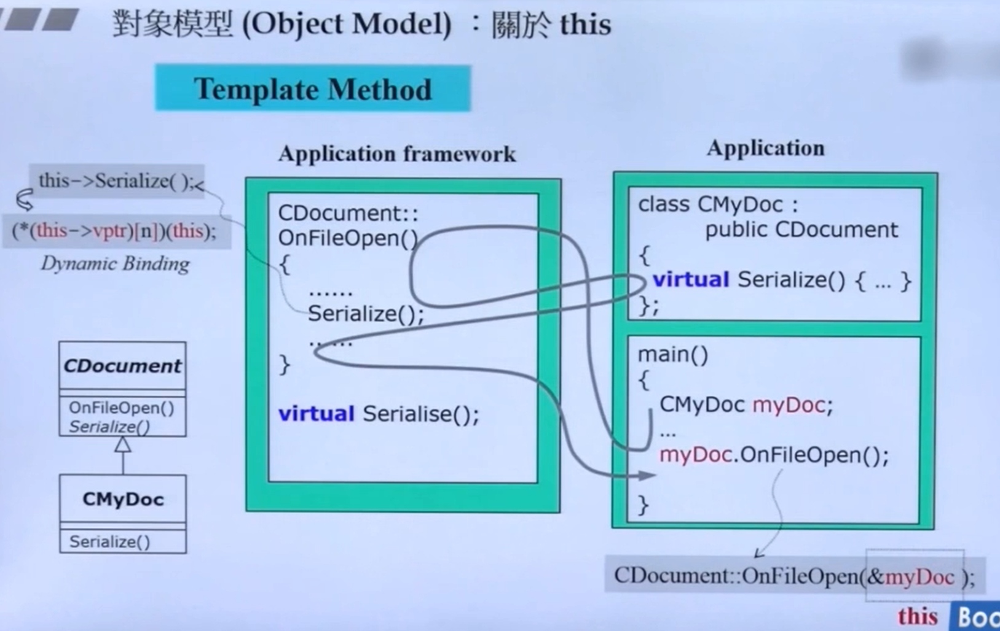


# 19 动态绑定 汇编代码

- 静态绑定


- 动态绑定：指针 ---> 虚指针 ---> 表 ---> 函数 ---> 指针作为参数传入，开启调用


# 20 const

当成员函数的 `const` 和 `non-const` 版本同时存在，`const object` 只能调用 `const` 版本，`non-const objec`t 只能调用 `non-const` 版本


# 21 new delete

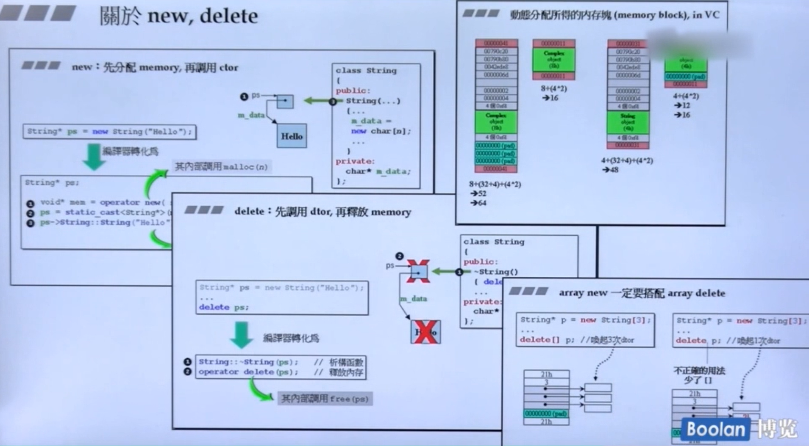


# 22 重载 ::operator new, ::operator delete, ::operator new[], ::operator delete[]

### **`new` 调用 `operator new` ， `operator new` 调用 `malloc`**

### **`delete` 调用 `operator delete` ， `operator delete` 调用 `free`**

加 `::` 表示全局作用域


如果想强制使用全局的 `operator new` ， `operater new[]` ，`operator delete` 和 `operator delete[]` ， 需要使用 `全局作用域符` `::` 。


# 23 22的示例

- 重载 `operator new` 和 `operator delete`
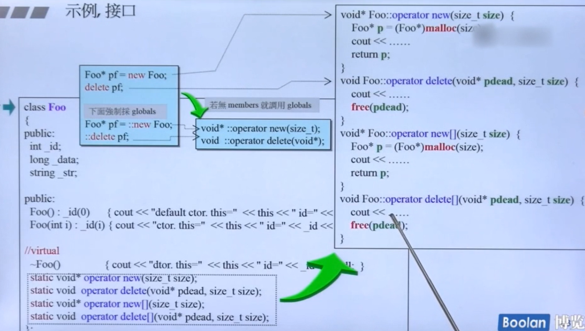

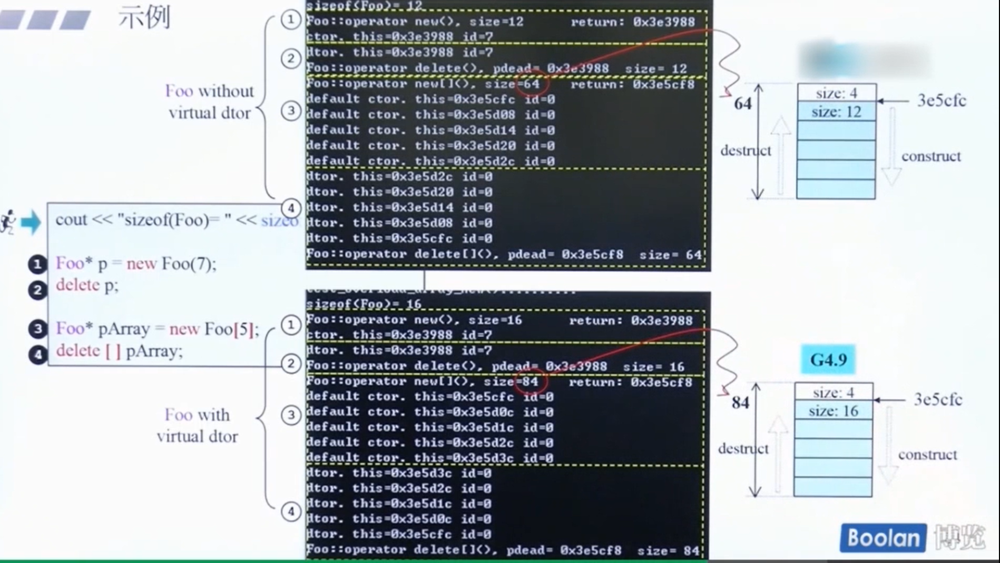

- 强制使用全局 `new` 和 `delete` ，`::new` 、 `::delete`
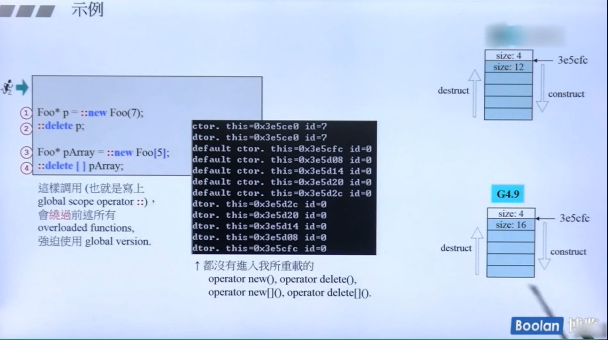


# 24 重载 placement new() delete()

`placement operator new` ，也是重载，和第 `22、23` 中是同一个函数，不过参数不同

话不多说，看图

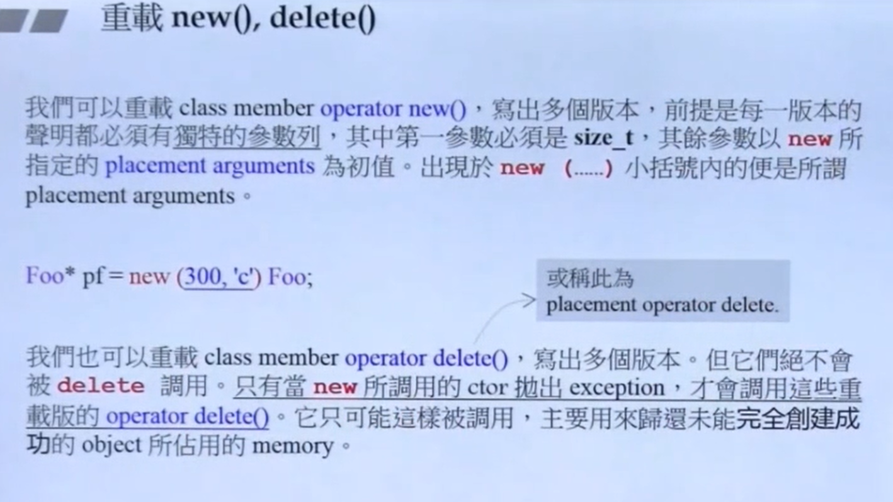

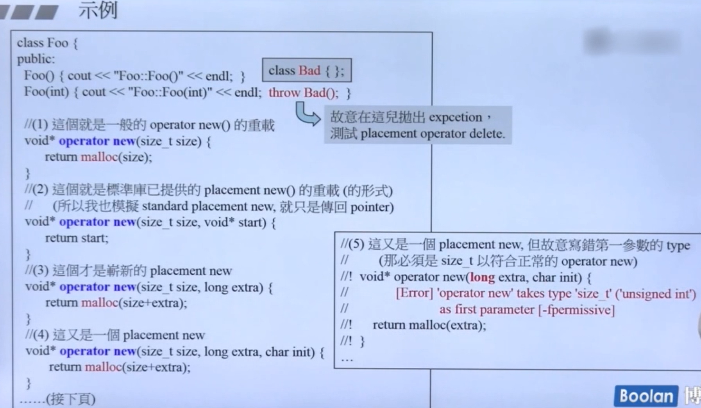

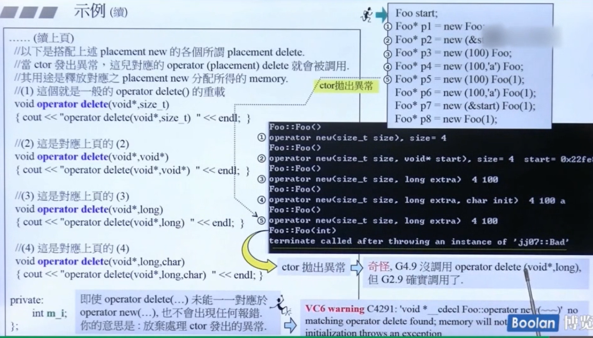


# 25 placement new() ： basic_string 使用 new(extra) 扩充申请量

重载 `operate new()` 为 `operate new(size_t s, size_t extra` ，利用该函数为字符串类创造计数器


# :: 作用域运算符

- ### 全局作用域
- ### 局部作用域（类作用域）    Class_Name::member
- ### 命名空间

#### 局部作用域时，如果调用的是类中的非静态对象，那么只能 “先生成一个对象，然后使用点语法访问需要访问的对象”


