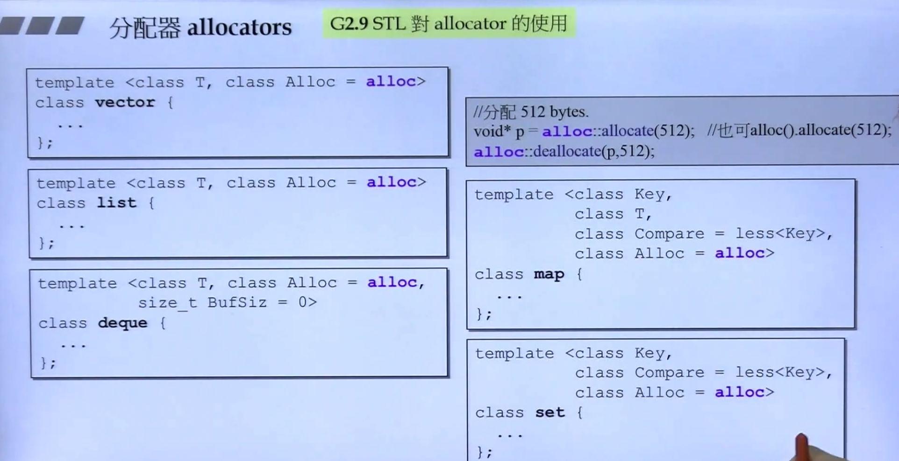
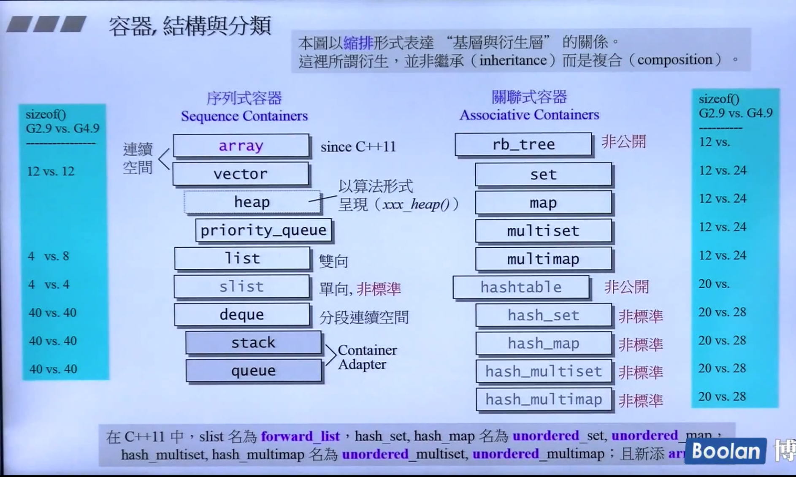

# c++ 体系结构与内核分析


- level 0：使用c++标准库
- level 1：认识c++标准库
- level 2：良好使用c++标准库
- level 3：扩充c++标准库


## 1 认识 headers 、版本、重要资源


c++标准库 > STL（标准模板库）


新式 headers 内的组件封装于 namespace "std"


## 2 STL体系结构基础介绍

#### STL 六大部件

- 容器（containers）
- 分配器（Allocators）
- 算法（Algorithms）
- 迭代器Iterators）
- 适配器（Adapters）
- 仿函式（Functors）


#### 六大部件使用示例

```c++
int main() {

    int ia[6] = {27, 210, 12, 47, 109, 83};
    vector<int, allocator<int>> vi(ia, ia+6);

    cout << cout_if(vi.begin(), vi.end(), not1(bind2nd(less<int>(), 40)))
}
```


#### `前闭后开`区间 `[  )`


## 3 容器分类与各种测试（一）


- 序列容器
  - Array
  - Vector
  - Deque
  - List
  - Forward-List
  - string
- 关联容器（红黑树）
  - set/multiset
  - map/multimap
  - unordered set/multiset （HashTable Separate Chaining）
  - unordered map/multimap


#### 容器种类图示


#### 无序容器实现（怎么感觉跟 `桶排序` 有点像） `Separate Chaining`


## 4 容器分类与各种测试（二）

vector 成长是 按两倍成长

可能造成内存浪费


## 5 容器分类与各种测试（三）


#### `stack` 和 `queue` 使用 `deque` ，且无iterator


## 6 容器分类与各种测试（四）

- 关联容器（红黑树）
  - set/multiset
  - map/multimap
  - unordered set/multiset （HashTable Separate Chaining）
  - unordered map/multimap

#### 关联容器查找很快

#### 无序容器中 `元素` 大于 `篮子` 时， `篮子` 扩充两倍


## 7 使用分配器 `allocator` ：支持容器对内存的使用

#### allocator 使用，不建议使用，不好用
- allocate(x)
- deallocate(T* p, x)


## 8 源代码之分布（VG、GCC）

#### gnu 2.9.1


## 9 OOP vs GP （范型编程）

#### GP：Generic Programming

#### - OOP：数据和算法关联一起
#### - GP：将data与methods分开


## 10 操作符重载 & 模板


# 第二节

## 11 分配器


#### VC6 <xmemory>
##### allocators
- allocate：allocate ---> operator new ---> alloc
- deallocate：deallocate ---> operator delete ---> free


#### GNU2.9 <defalloc.h>
##### allocators
- allocate：allocate ---> operator new ---> alloc
- deallocate：deallocate ---> operator delete ---> free

#### 是同 VC6


#### **使用 malloc 和 free 来管理内存，会带来大量额外开销，现实中区块小，额外开销占比大**

#### 如右下角说明，GNU C 虽然实现了，但并未使用这个allocator，而是另有实现


#### 实际使用 `alloc` 为了减少额外开销，所以要减少 malloc 次数



#### alloc 实现


#### gnu4.5以后已改回最基础的实现


## 12 容器之间的实现关系与分类

#### 关系图



## 13 深度探索list（上）


