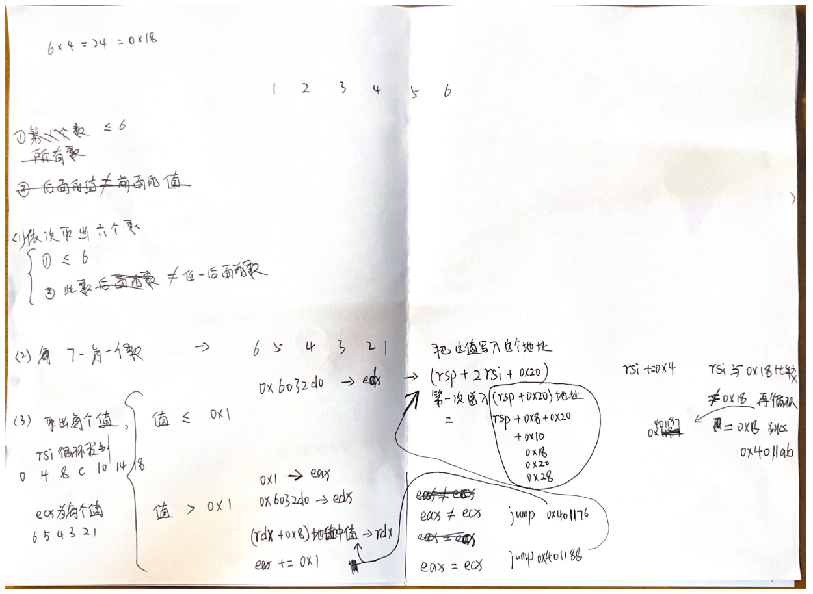
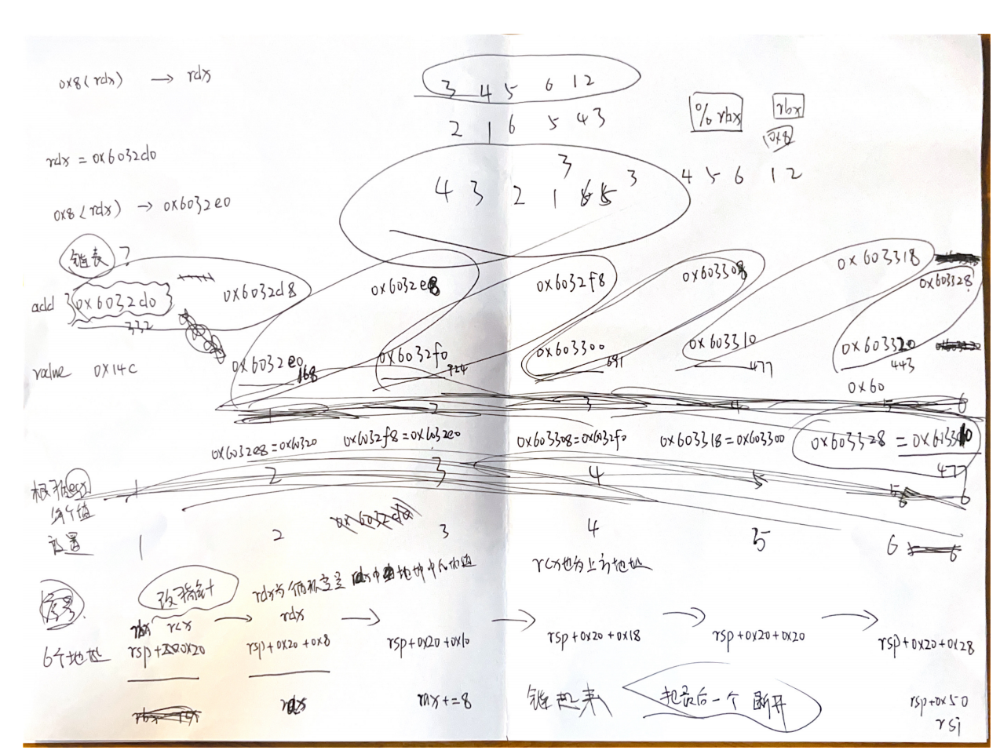
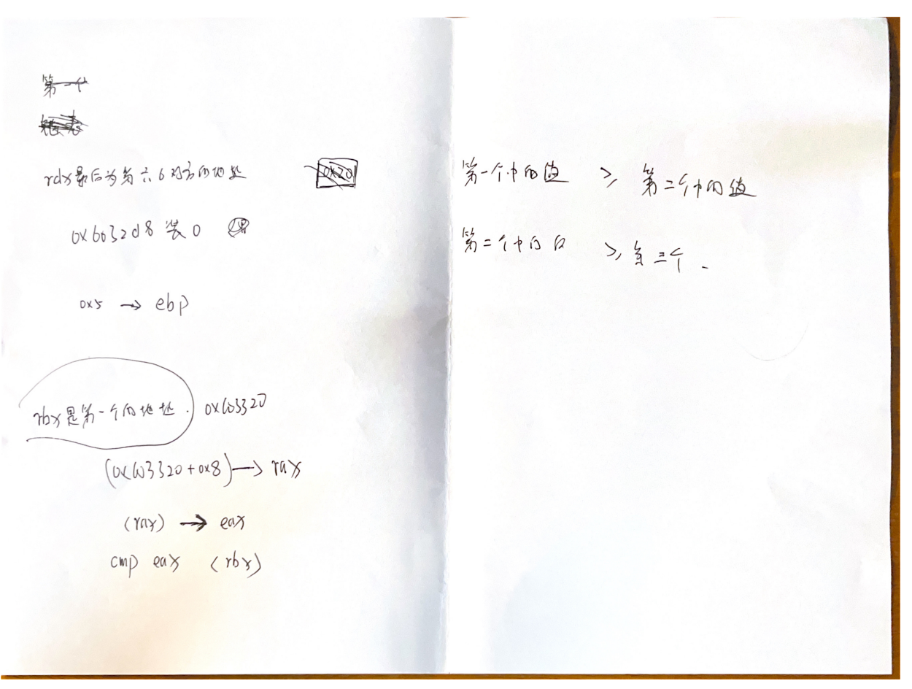

#### 1 字符串

Border relations with Canada have never been better.

```
x /s $rdi    # 这个是我输入的字符串
x /s $rsi    # 这个是程序比较的字符
```


#### 2 六个数字

1 2 4 8 16 32

逻辑：第一个数字是否为 **0x1**，以此翻倍


#### 3 两个数字

（0，207）（1，311）（2，707）（3，256）（4，389）（5，206）（6，682）（7，327）

这八组数字 任一组都满足都可以 对应 **分支结构**，**switch** ？**if** ?


#### 4 两个数字

(7, 0)


#### 5 字符串

**ionefg**

逻辑：有一个对应的字符串，根据输入的 **ionefg ** 通过在26英文字母表的关系 映射到 那个对应字符串上，然后得到输出字符串 **flyers**


#### 6 六个数字

[4, 3, 2, 1, 6, 5]

1. 依次取出六个值，值小于等于6，且此数 不等于 后位置任意一位数（就是六个数字不能出现相同）
2. 依次取出六个值，作减法：7 - 值

前两步比较简单

**后面就难了**

跟 **链表** 有关



**链表**

这六个圈 就是六个链表中的节点，左下为节点起点，右上为节点中的指针，指针下方就是这个指针里面存的地址，这六个圈 从左到右 的状态 就是链表的原始状态

 六个圈 从左到右 分别是 **1-6** 六个数字对应的链表的节点

如果 原始给的数字中有 0 -1，那么用 7-x 之后，值为 7和8 未验证链表节点是否有这么长


按照输入 六个数字的顺序 用 7-x 之后，得到的结果依旧在0-1内，按照这个结果的顺序将对应的链表节点重新链接

之后比较链表

链表头 >= 中间节点 >= 链表尾



