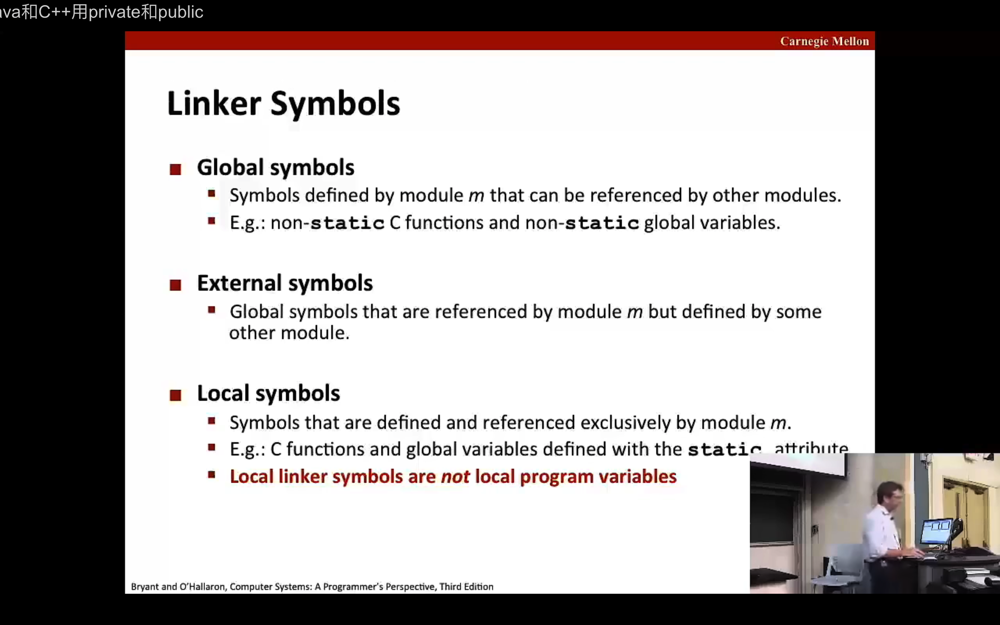
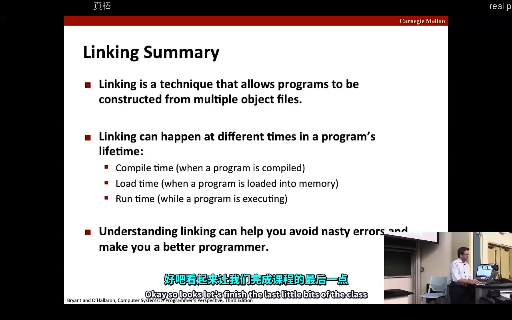
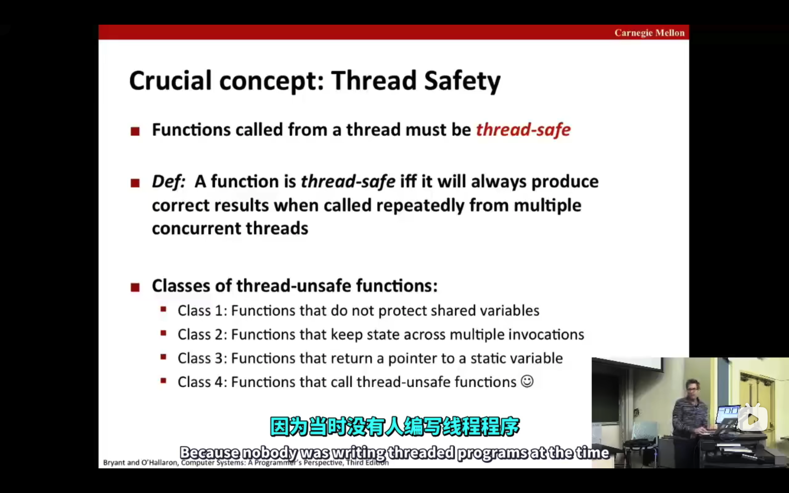
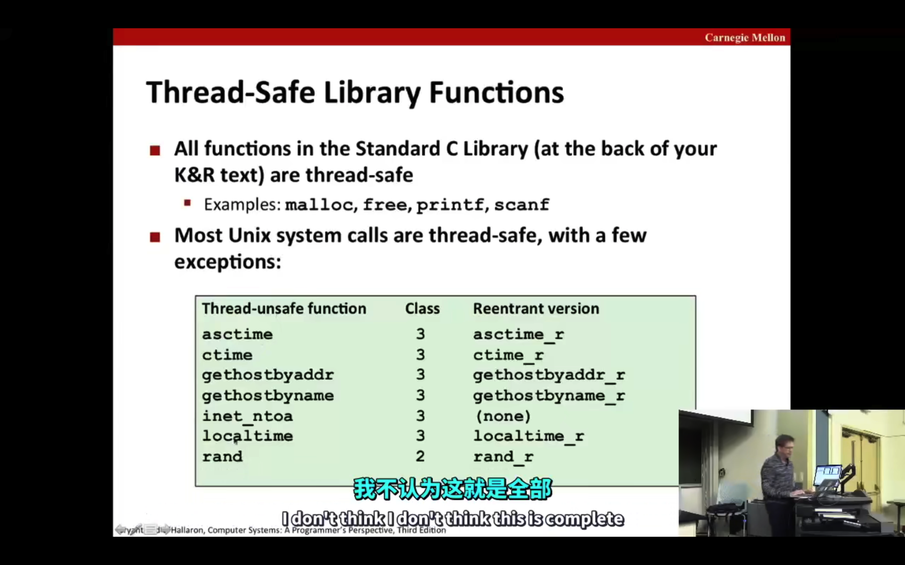
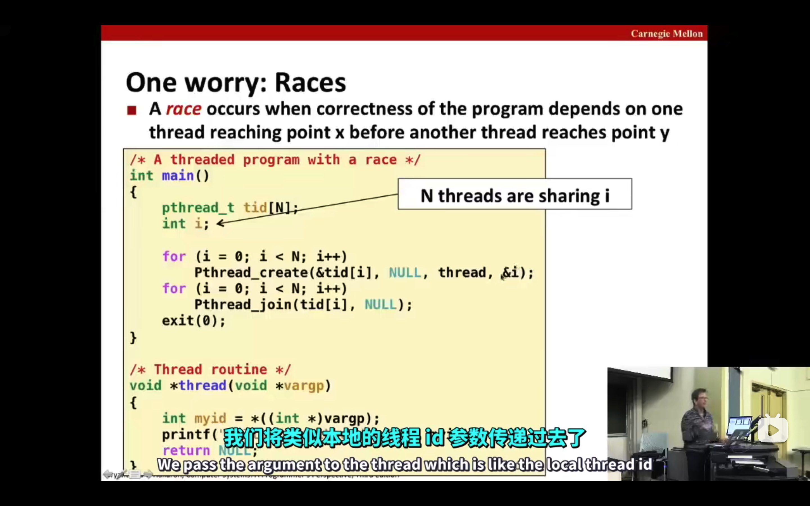
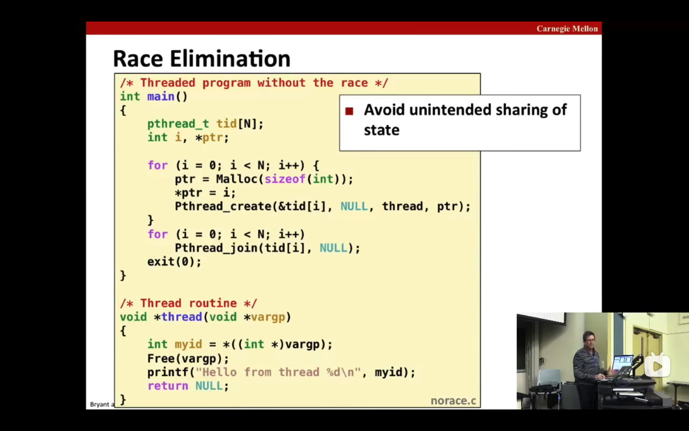
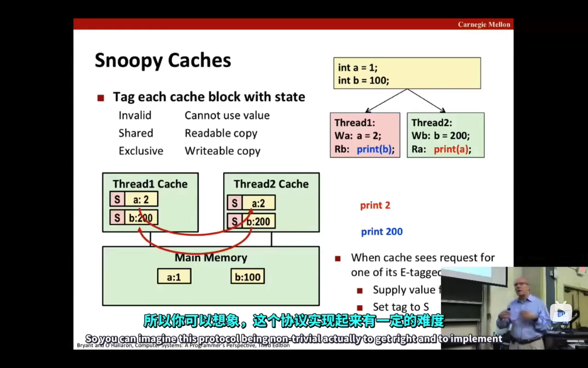
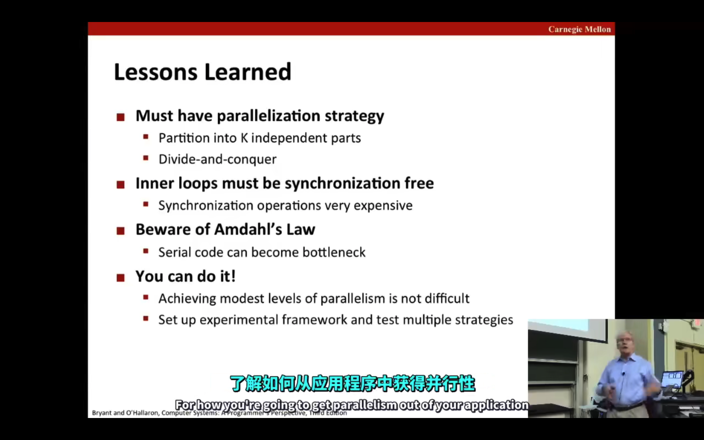

## Lecture 10 Program optimization

### 编译器优化影响
#### 移位操作(<< >>)、加法 代替 乘法(需要较多时钟周期)


#### for(statement1; statement2; statement3)

statement2、statement3循环多次，避免函数调用


#### 内存别名
以下代码对a[i]进行多次内存读写
为了避免存在**内存别名**(a、b指向同块内存)，优化后改变原义，编译器不优化
```
int i;
for (i=0; i < len; ++i) {
    a[1] += b[i]
}
```
改为：
```
int i = 0;
int var = 0;
for (i=0; i < len; ++i) {
    var += b[i]
}
a[1] = var
```


## Lecture 11 Memory Hierachy

- the speed gap between CPU, memory and mass storage continus to widen
- Well-written programs exhibit a property called **locality**（程序的局限性：时间局限性、空间局限性）
- Memory hierarchied based on caching close the gap by exploiting locality（内存层级基于缓存，上级是下级的缓存）、


## Lecture 12 Cache Memories

code improve locality (include spatial locality and temporal locality)
focus on inner loop


## Lecture 13 Linking

#### Why Linkers?
- modularity
- efficiency: 分离式编译 改动源文件不需要全部重新编译


#### What do linkers do
- step1: Symbol resolution（符号解析）
- step2: Relocation






## Lecture 14 15 Exception Control Flow（ECF）

- 进程
- 进程上下文（逻辑控制、地址空间）
- 进程上下文切换 context switch
- fork() copy on write
- 信号（内核-->进程 ｜ 进程-->内核-->进程）
- 涉及到信号的处理，**并发安全、死锁**


## Lecture 16 System I/O

- low level Unix I/O（异步信号安全）
- library I/O
- rio（针对网络应用）


## Lecture 17 18 Virtual Memory

- MMU 地址转换
- 多级页表，需要转入内存的页表才分配，节约页表空间
- 内存管理
- 内存保护


## Lecture 23 Concurrent Programing

- 多进程
- 基于事件（I/O复用）
- 多线层（peer thread）


## Lecture 24 25 Synchronization

### Basics

- 栈区也是共享的
任意线程、主进程可以通过全局变量记录下任意线程、主进程的栈区数据的地址，从而访问到任意线程、主进程的栈区

- 线程间对共享变量的访问，需要同步来实现
- 可以通过“信号”，P、V 操作来实现`阻塞`、`同步`。

### Advance

#### 同步问题
- 生产者-消费者
- 读者-作家

#### 线程安全问题




#### 可重入函数
线程安全函数包含可重入函数

#### 竞争
这个地方如果把 &i改为i，行不行，这里是固定的(void*)，可能不行，但是是另一种自己编写的函数呢，行得通吗？会解决竞争吗，取决于是否在线程自己的栈创建完成（完成穿参），再开始运行主进程



解决方法：



#### 死锁问题

解决方法：以相同顺序获得资源


## Lecture 26 Thread-level Parallelism

超线程

提高并行效率
- 消除（减弱）共享资源
- 减少内存读写，增加寄存器读写（内存读写转为函数局部）

并行程序性能刻画
speedup
efficiency
amdahl's law 性能取决于不能被优化的那部分（短板）

给出了 quicksort 的多线程版本（官网有代码？）

数据一致性
- 多核心 snoopy caches
- 进阶 `MESI（多核CPU cache缓存一致性协议）`





是不是所有程序语言都有汇编代码？其他语言怎么控制寄存器？
程序语言分类？

编译型语言 解释型语言 混合


# 课程总结

- 整数、浮点数表示（01如何表示数字）
- 汇编、程序优化（更底层语言，怎么操控寄存器、内存、传参、函数调用栈）
- 内存层级、缓存（内存架构、虚拟内存--->真实内存，重要概念--缓存）
- 链接（编译-链接，不同文件怎么形成一个可执行程序）
- 异常控制流（进程、异常、内核态、用户态、上下文切换context switch、信号）
- 系统 I/O（所有I/O当成文件去处理，通过文件描述符抽象来读写）
- 虚拟内存（抽象、程序单独的地址空间）
- 动态内存分配（堆区管理、分配、回收、归还操作系统）
- 网络编程（ip、port、TCP/UDP、套接字socket）
- 并发编程（进程、并发I/O、线程）
- 并发问题--资源冲突--同步（线程并发，共享资源导致的竞争，怎么解决同步？）
- 线程级并发（减少同步带来的影响，加速程序运行）


# 程序运行
1. 代码编写
2. 编译（词法分析、语法分析（AST）、语义分析、中间代码生成、优化、代码生成）
3. 链接（或者链接包含在编译的最末端？） ---> 可执行程序
4. 载入内存（内存层级--缓存），虚拟内存 ---> 真实内存
5. CPU执行

## 执行中
6. 异常控制流（时间片中断、系统调用），用户态、内核态切换、上下文切换context switch
7. 函数调用（函数调用栈、栈帧）
8. IO、网络连接
9. 并发、线程并发导致的同步问题、进程并发的通信（pipeline）、减少同步的影响、加速并发
10. 动态内存管理（分配、回收、归还操作系统）

11. 硬件如何理解 指令代码 