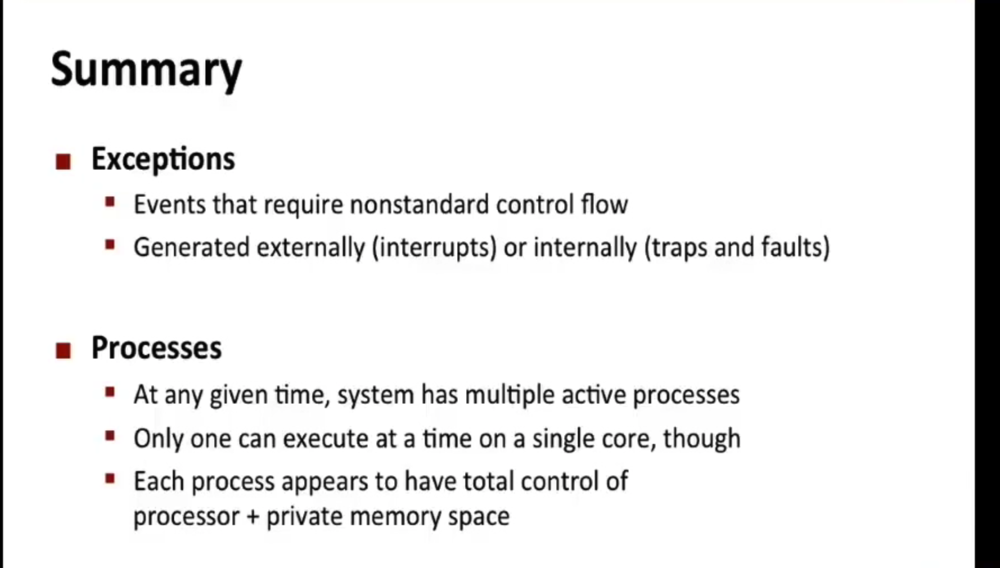
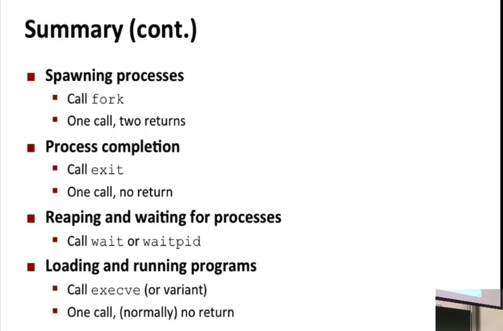
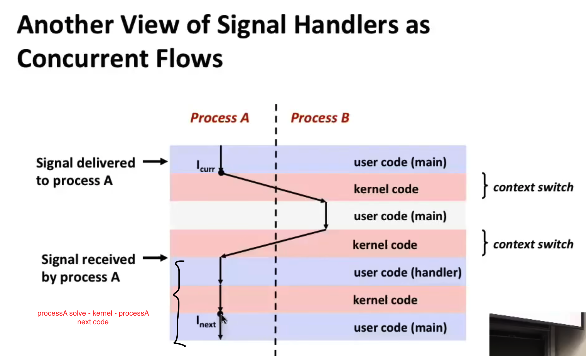
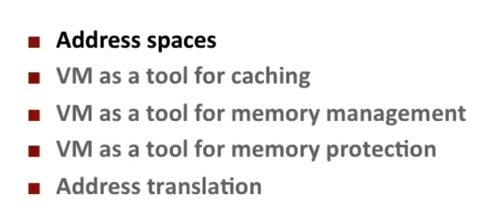
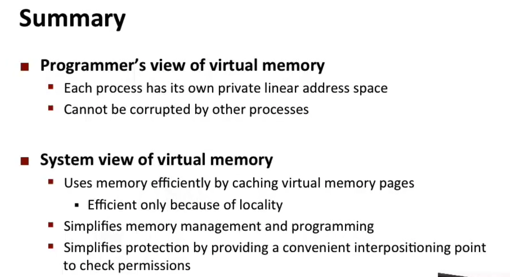
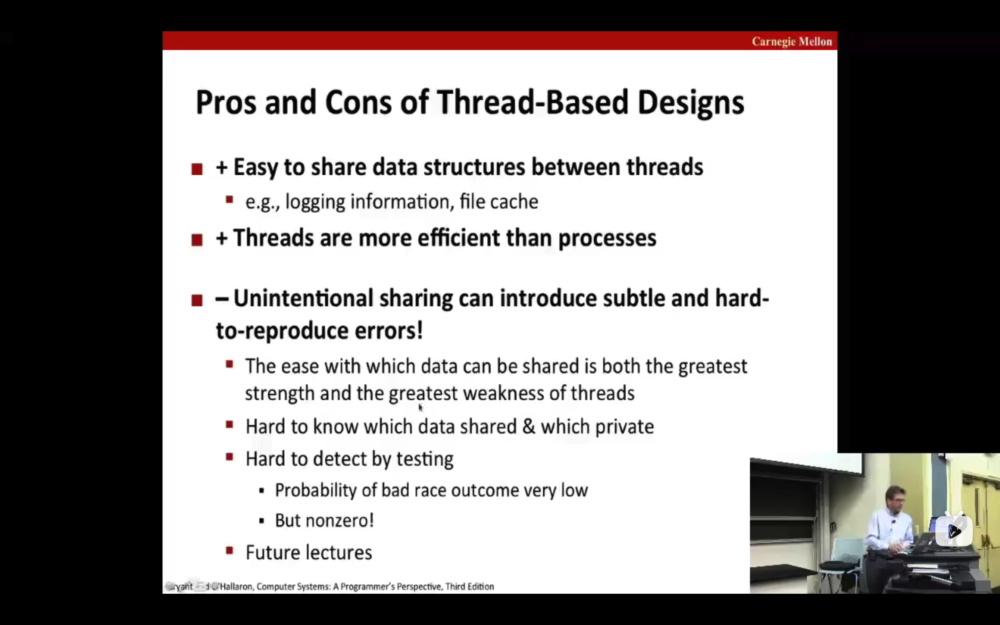
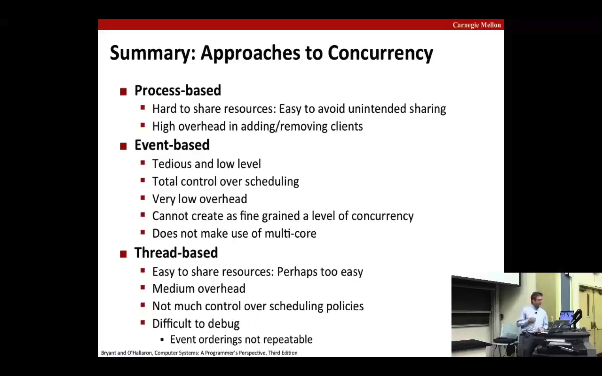

## Lecture 10 Program optimization

### 编译器优化影响
#### 移位操作(<< >>)、加法 代替 乘法(需要较多时钟周期)


#### for(statement1; statement2; statement3)

statement2、statement3循环多次，避免函数调用


#### 内存别名
以下代码对a[i]进行多次内存读写
为了避免存在**内存别名**(a、b指向同块内存)，优化后改变原义，编译器不优化
```
int i;
for (i=0; i < len; ++i) {
    a[1] += b[i]
}
```
改为：
```
int i = 0;
int var = 0;
for (i=0; i < len; ++i) {
    var += b[i]
}
a[1] = var
```


## Lecture 11 Memory Hierachy

- the speed gap between CPU, memory and mass storage continus to widen
- Well-written programs exhibit a property called **locality**（程序的局限性：时间局限性、空间局限性）
- Memory hierarchied based on caching close the gap by exploiting locality（内存层级基于缓存，上级是下级的缓存）、


## Lecture 12 Cache Memories

code improve locality (include spatial locality and temporal locality)
focus on inner loop


## Lecture 13 Linking

#### Why Linkers?
- modularity
- efficiency: 分离式编译 改动源文件不需要全部重新编译


#### What do linkers do
- step1: Symbol resolution（符号解析）
- step2: Relocation


## Lecture 14 15 Exception Control Flow（ECF）

- 进程
- 进程上下文（逻辑控制、地址空间）
- 进程上下文切换 context switch
- fork() copy on write
- 信号（内核-->进程 ｜ 进程-->内核-->进程）
- 涉及到信号的处理，**并发安全、死锁**








## Lecture 16 System I/O

- low level Unix I/O（异步信号安全）
- library I/O
- rio（针对网络应用）


## Lecture 17 18 Virtual Memory

- MMU 地址转换
- 多级页表，需要转入内存的页表才分配，节约页表空间
- 内存管理
- 内存保护







## Lecture 23 Concurrent Programing

- 多进程
- 基于事件
- 多线层（peer thread）






## Lecture 24 25 Synchronization

### Basics

- 栈区也是共享的
任意线程、主进程可以通过全局变量记录下任意线程、主进程的栈区数据的地址，从而访问到任意线程、主进程的栈区

- 线程间对共享变量的访问，需要同步来实现
- 可以通过“信号”，P、V 操作来实现`阻塞`、`同步`。

### Advance