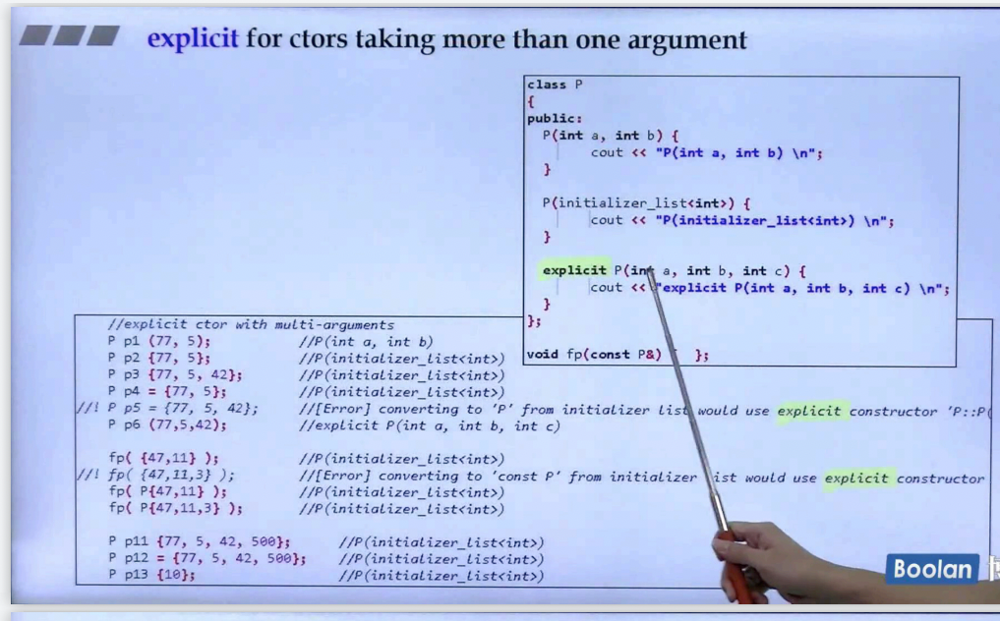
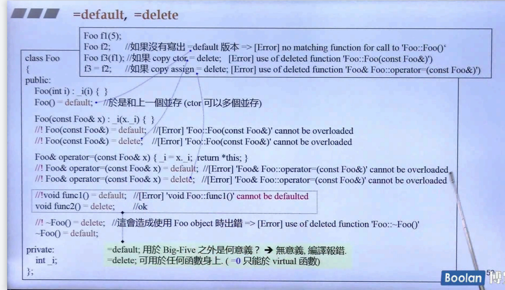
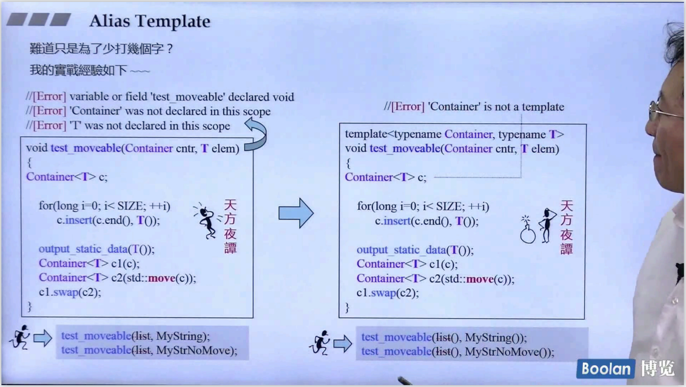

# c++11


# 第一讲 语言
## 1


## 2 variadic templates：数量不变模版参数

#### 递归：分解不定参数

#### tuple 实现


## 3 
- Spaces in Template Expressions
- `nullptr` instead of 0 or NULL
- Automatic Type Deduction with `auto`


## 4
- Uniform Initialization `{}`
- initializer_list<T>


## 5 6 initializer_list<T>
- 不允许 `narrowing` 转化
- 使用 `{}` ，如果有 initializer_list 的构造函数，那么不拆解，调用这个版本；如果没有initializer_list 的构造函数，那就拆解 `{}` 中的元素，调用其他构造函数
- 背后支持是 array 
- stl 中 `容器、算法` 都有用到 initializer_list


## 7 explicit

#### 作用于 构造函数时，避免 `隐式转换` 

#### 下面这张图有点没看懂



## 8 range-based for statement
```c++
for (decl : coll) {
    statement
}

// 其实也就是 用迭代器来实现
for (auto _pos = coll.begin(), _end = coll.end(); _end != _pos; ++_pos) {
    decl = *_pos;
    statement
}
```


## 9 =default =delete



#### 带有 pointer member 需要实现 big five
- 拷贝构造
- 拷贝复制
- 析构
- 移动拷贝构造
- 移动拷贝复制


## 10 11 Alias Template
#### 作用
- alias 别名
- #### 避免 template template parameter 不能进行 默认参数绑定

```c++
template<typename T>
using Vec = vector<T, allocator<T>>;

// 使用
Vec<int> veci;
// 等价于
vector<int, allocator<int>> veci;
```

#### 比如下面这种情况，解决方案：
##### 报错：'Container is not a template'
1. 传入 vector<int>() , 利用萃取机 取出 int
2. 使用 template template parameter + alias template ，避免template template parameter 不能进行 默认参数绑定



## 12 type alias

- using xxx = yyy
- typedef yyy xxx

#### using
- using namespace std / using std::cout

#### noexcept
###### 尤其是作为 vector 的元素时，move constructor and destructor does not throw
###### decclares that foo() won't throw
```c++
void foo() noexcept;
void swap(Type &x, Type &y) noexcept(noexcept(x.swap(y))) {
    x.swap(y);
}
```


#### override
- 仅有 virtual 才能 override
- 提醒用户 是否真的重写，而不是因为函数签名不同造成重新定义
```c++
virtual void func(int) override {};
```


#### final
```c++
// 不可被继承
struct Base1 final {};
// struct Base2 的子类不可 重写
struct Base2 {
    virtual void f() final;
};
```


## 13 decltye: defines a type equivalent to the type of an expression
1. declare return types
```c++
template<typename T1, typename T2>
auto add(T1 x, T2 y) -> decltype(x+y);

// 上述为新写法，由于从左往右编译，下述代码编译无法通过
decltype(x+y) add(T1 x, T2 y);
```
2. metaprograming
3. pass the type of a lambda


## 14 lambdas


# 第二讲 标准库