# c++内存管理

- 第一讲：primitives
- 第二讲：std::allocator
- 第三讲：malloc/free
- 第四讲：loko::allocator
- 第五讲：other allocator


## 1 overview


## 2 内存分配的每一层面

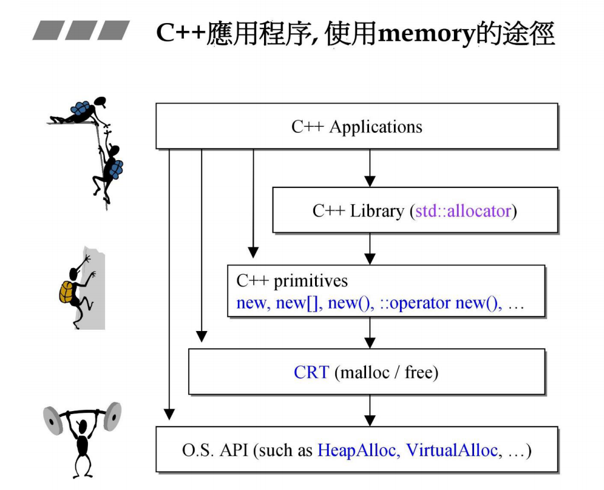

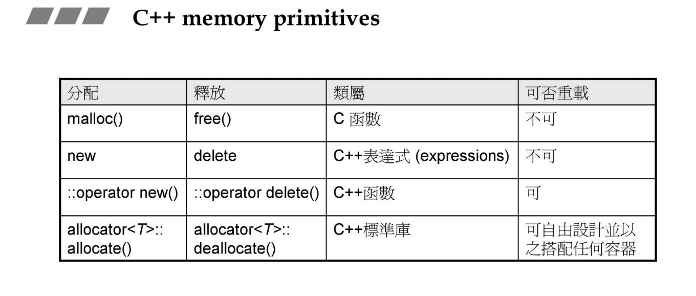


## 3 四个层面的基本用法

```c++
// 1 malloc free
void* p1 = malloc(512);
free(p1);

// 2 new delete 表达式
complex<int>* p2 = new complex<int>;
delete p2;

// 3 operator new()   operator delete()
void* p3 = ::operator new(512);
::operator delete(p3);

// 4 stl 的 allocator
// 三个版本

#ifdef _MSC_VER
    // 分配3个int
    int* p4 = allocator<int>().allocate(3, (int*)0);
    allocator<int>().deallocate(p4, 3);
#endif
#ifdef _BORLANDC
    // 分配5个int
    int* p4 = allocator<int>().allocate(5);
    allocator<int>().deallocate(p4, 5);
#endif
#ifdef __GNUC__
    // 分配512bytes
    void* p4 = alloc::allocate(512);
    alloc::deallocate(p4, 512)
#endif
// GNUC另外的版本
#ifdef __GNUC__
    // 分配7个int
    void* p4 = allocator<int>().allocate(7);
    allocator<int>().deallocate((int*)p4, 7)
```


## 4 5 6 new expression / delete expression

#### new expression
##### new --> operator new ---> malloc
```c++
Complex* pc = new Complex(1, 2);
// 相当于
Complex* pc;
try {
    // 开辟内存
    void* mem = operator new(sizeof(Complex));
    pc = static_const<Complex*>(mem);
    // 创建对象
    pc->Complex::Complex(1,2);
} catch (std::bad_alloc) {
    // 若allocation失败就不执行constructor
}
```
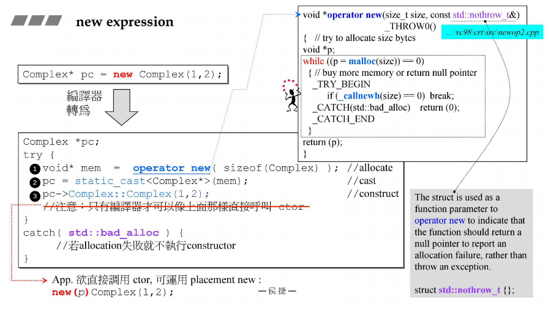


#### delete expression
##### delete ---> 析构 & operator delete ---> free()
```c++
Complex* pc = new Complex(1, 2);
...
delete pc;

// 相当于
pc->~Complex();
operator delete(pc);
```
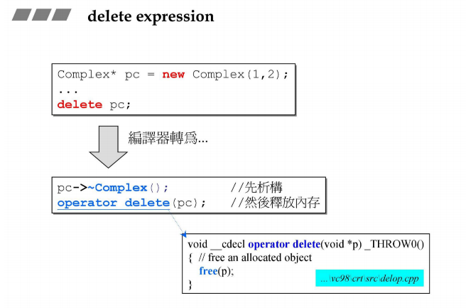


#### Ctor 不能由对象直接调用，但有的编译器版本可以这么做，这么做不严谨


## 7 array new & array delete

#### 应当配合使用，new 搭配 delete，array new 搭配 array delete
#### array delete 会调用相当次数的 `析构函数` ，避免内存泄露（成员指针指向的内存）


## 8 placement new ，定点new

```c++
#include <new>
char* buf = new char[sizeof(Complex)*3];
Complex* pc = new(buf)Complex(1,2);
...
delete[] buff;

// 编译器转为
Complex *pc;
try {
    void *m = operator new(sizeof(Complex), buf);
    pc = static_const<Complex*>(mem);
    pc->Complex::Complex(1,2);
} catch (std::bad_alloc) {
    // 若allocation失败就不执行constructor
}
```

#### placement new 指的是 new(p) 或 有参数的 ::operator new(size, void*)

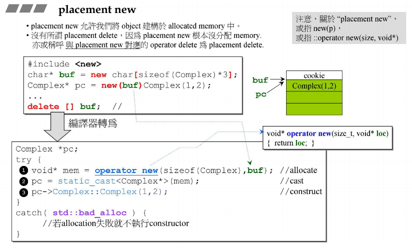


## 9 重载

#### c++应用程序分配内存
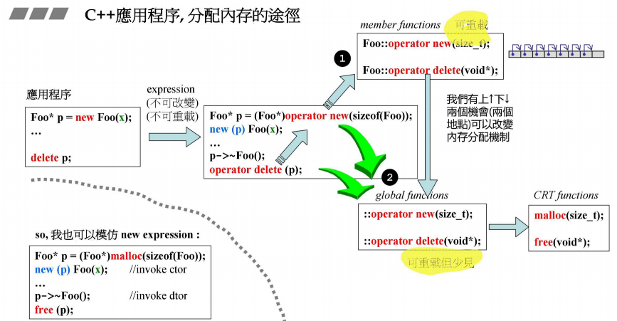

#### c++容器分配内存
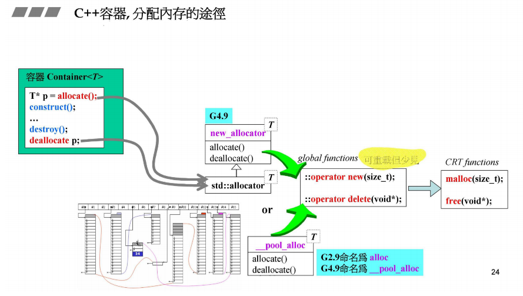

### *三把刀 如何接管内存分配，做内存池*
#### ::operator new & delete
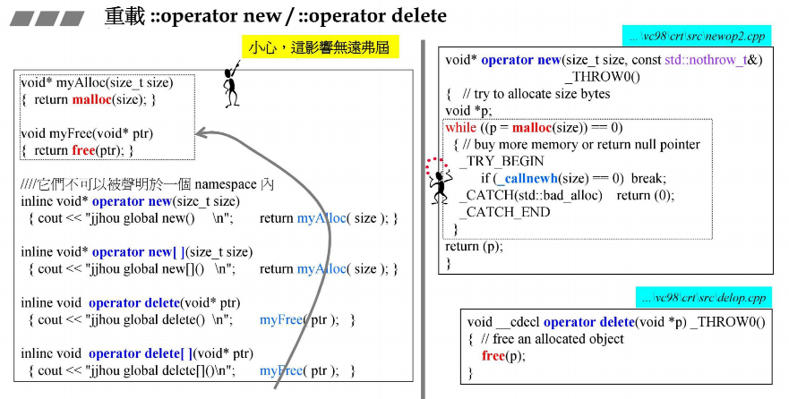

#### operator new & delete
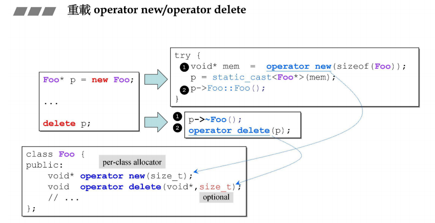

#### operator new[] & delete[]
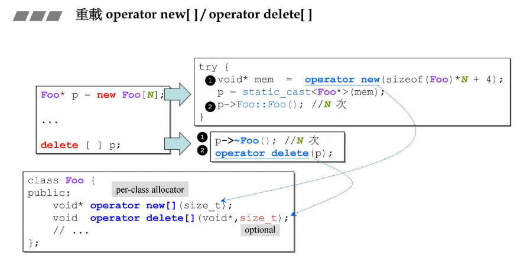


## 10 11 重载示例

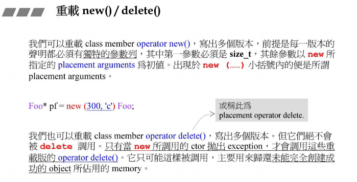
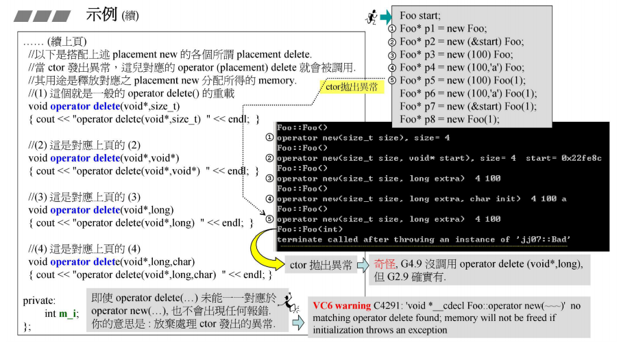


## 12 per-class allocator 一个类对应一个allocator

#### 重载 operator new & delete ，避免多次malloc

```c++
#include <cstddef>
#include <iostream>
using namespace std;

class Screen {
public:
    Screen(int x): i(x) {}
    int get() { return i; }
    // 重载
    void* operator new(size_t);
    void operator delete(void*, size_t);

private:
    int i;
    Screen *next;
    static Screen *freeStore;
    static const int screenChunk;
};
// 类内静态变量再次声明，为什么？？
Screen* Screen::freeStore = 0;
const int Screen::screenChunk = 24;

void* Screen::operator new(size_t size) {
    Screen *p;
    if (!freeStore) {
        // linked list 是空的，所以申请一大截
        size_t chunk = screenChunk * size;
        freeStore = p = reinterpret_cast<Screen*>(new char[chunk]);
        // 将一大块分割成片，当作 linked list 串接起来
        for (; p != &freeStore[screenChunk - 1]; ++p)
            p->next = p + 1;
        p->next = 0;
    }
    p = freeStore;
    freeStore = freeStore->next;
    return p;
}

void Screen::operator delete(void *p, size_t) {
    // 将 deleted object 插回 free list 前端
    (static_cast<Screen*>(p))->next = freeStore;
    freeStore = static_cast<Screen*>(p);
}
```


## 13 per-class allocator2 一个类对应一个allocator的改进

#### 将 数据 与 next指针 组合成结构体，避免 next指针 对内存的消耗
#### 当未将已经分配的内存给到 新的指针时，使用 next指针 串联分配的整块内存空间，使用联合体有效解决


```c++
using namespace std;
class Airplane {
public:
    unsigned long getMiles() { return miles; }
    char getType() { return type; }
    void set(unsigned long m, char t) {
        rep.miles = m;
        rep.type = t;
    }

    static void* operator new(size_t size);
    static void operator delete(void* deadObejct, size_t size);

private:
    struct AirplaneRep {
        usigned long miles;
        char type;
    };
    union {
        AirplaneRep rep;
        Airplane *next;
    }

private:
    static const int BLOCK_SIZE;
    static Airplane* headOfFreeList;
};

// 类内静态变量再次声明
const int Airplane::BLOCK_SIZE = 512;
Airplane* Airplane::headOfFreeList;

void* Airplane::operator new(size_t size) {
    // 如果有继承关系的时候，size会有区别
    if (size != sizeof(Airplace))
        return ::operator new(size);

    Airplane* p = headOfFreeTree;
    if (p) {
        // 还有空间
        headOfFreeTree = headOfFreeTree->next;
    } else {
        // 没有空间了，一次性分配多个空间
        Airplane* newBlock = static_cast<Airplane*>(::operator new(size * BLOCK_SIZE));
        // 链接分配的内存
        for(int i = 1; i < BLOCK_SIZE-1; ++i) {
            newBlock[i].next = &newBlock[i+1];
        }
        newBlock[BLOCK_SIZE-1].next = NULL;
        p = newBlock;
        headOfFreeTree = &newBlock[1];
    }

    return p;
}

void Airplane::operator delete(void* deadObject, size_t size)  {
    if (deadObject == 0) return;
    if (size != sizeof(Airplane)) {
        ::operator delete(deadObject);
        return;
    }

    Airplane* carcass = static_cast<Airplane*>(deadObject);

    carcass->next = headOfFreeTree;
    headOfFreeTree = carcass;
}
```


## 为什么要再次声明类内静态变量

- 类内定义非const的静态成员变量会导致静态成员被重复定义，所以在类外定义类内静态变量，分配内存
- 类内可以定义const的静态成员变量


## 14 封装 static allocator

#### 封装，不在需要每个类实现一遍

```c++
class allocator {
private:
    struct obj {
        struct obj* next;
    };
public:
    void* allocate(size_t);
    void deallocate(void*, size_t);
private:
    obj* freeStore = nullptr;
    const int CHUNK = 5;
}

void* allocator::allocate(size_t size) {
    obj* p;
    if (!freeStore) {
        size_t chunk = CHUNK * size;
        freeStore = p = (obj*)malloc(chunk);

        for (int i = 0; i < CHUNK-1; ++i) {
            p->next = (obj*)((char*)p+size);
            p = p->next;
        }
        p->next = nullptr;
    }
    p = freeStore;
    freeStore = freeStore->next;
    return p;
}

void allocator::deallocate(void* p, size_t) {
    ((obj*)p)->next = freeStore;
    freeStore = (obj*)p;
}

class F00 {
public:
    long L;
    string str;
    static allocator myAlloc;
public:
    Foo(long l):L(l) {}
    static void* operator new(size_t size) { return myAlloc::allocate(size); }
    static void operator delete(void pdead, size_t size) {return myAlloc::deallocate(pdead, size); }
}
allocator Foo::myAlloc;
```


## 15 macro for static allocator

#### 使用宏减轻代码量
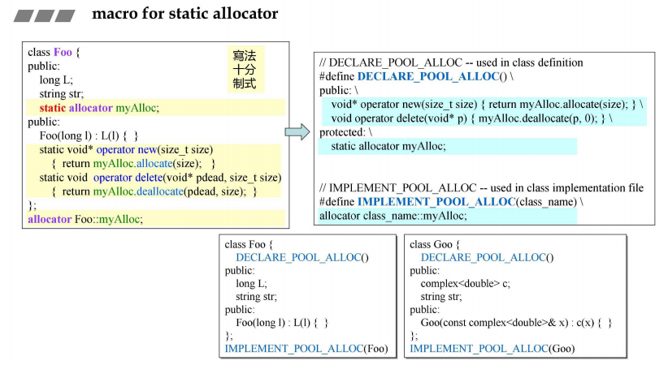


## 16 new handler

#### 标准库上的实现
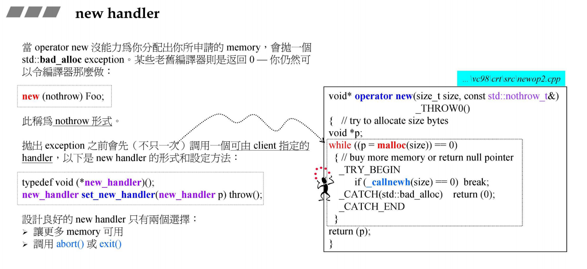

#### new handler使用
#### std::set_new_handler(函数名)
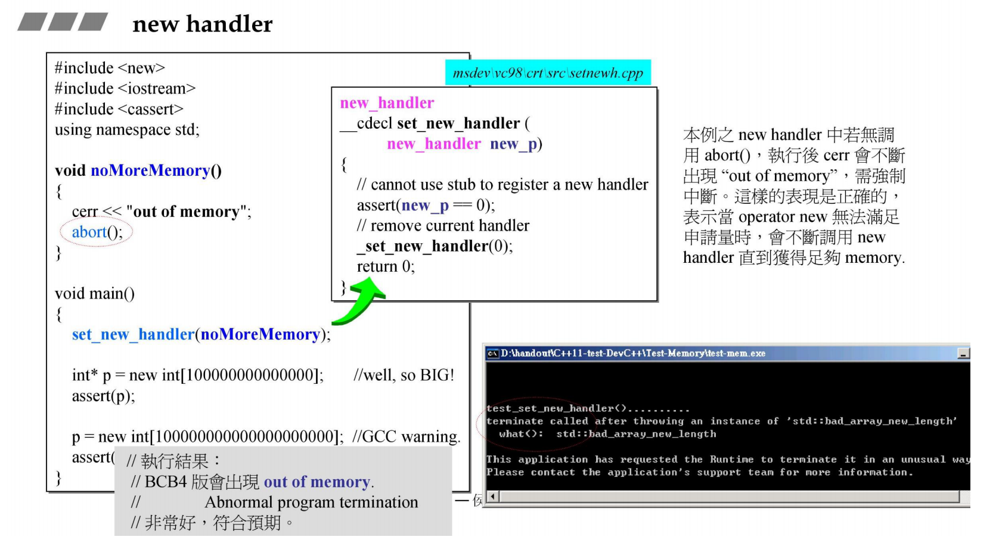

#### c++11 新特性 default delete
- 构造、拷贝构造、拷贝复制、析构 可有
- operator new & delete 可有 delete


# 第二讲 std::allocator


## 17 VC6 malloc


## 18 19 VC6 & BC5 标准分配器之实现

#### VC6 & BC5 的allocator只是以 ::operator new & delete 完成 allocate() 和 deallocate() ，没有特殊设计。


## 20 GNU C 2.9 标准分配器实现

## 有实现和上面两个版本一样的实现，但实现的标准库并未使用这个版本
## 使用的 不是 std::allocator ，而是 std::alloc


## 21 G2.9 std::alloc  VS G4.9 __pool_alloc

#### 这两个换汤不换药


## 22 G4.9 标准分配器之实现 体制内的 `allocator`

#### allocator只是以 ::operator new & delete 完成 allocate() 和 deallocate() ，没有特殊设计。


## 23 G2.9 std::alloc

#### 16根指针
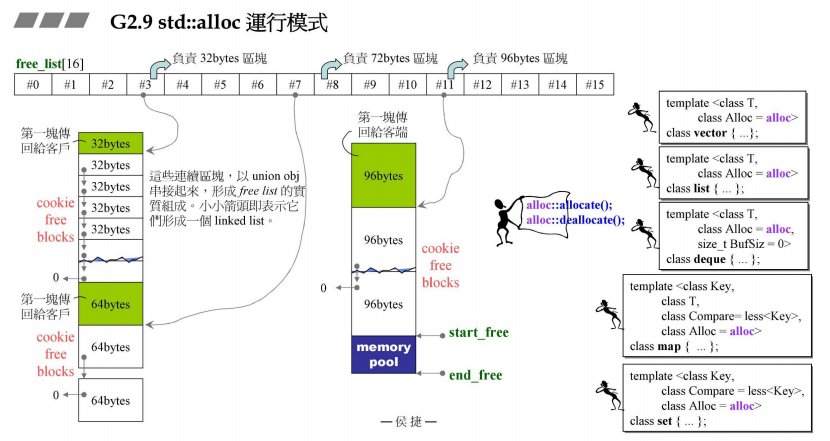

#### 嵌入式指针
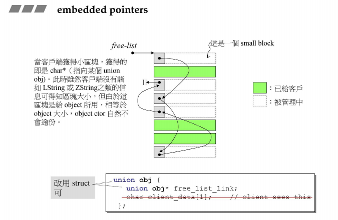


## 24 25 26 G2.9std_alloc运行一瞥


## 27 28 29 30 G2.9 std::alloc源码剖析-上

#### 问题：
- deallocate中，如何避免 指针p 并非有 alloc 分配出去的
- deallocate中，如何避免 指针p 所指向的大小不是 8 的倍数

#### A：
- 第一个问题，确实这么做不好
- 第二个问题，看看怎么避免分配的时候有 不是8的倍数 的情况，再避免回收的时候 不是8的倍数 的情况


## 批斗

#### 系统设计：没有指针指向cookie，无法向操作系统归内存

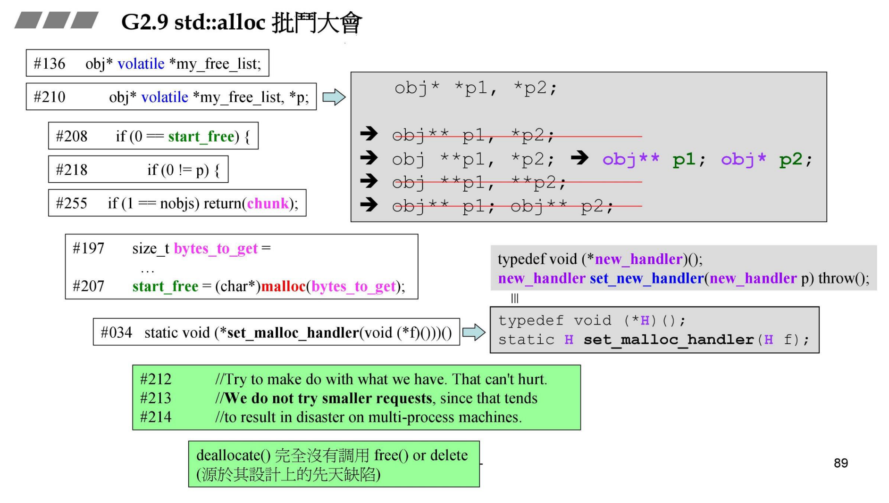


# 有点问题
# 右值引用
# 下面这张图理解 拷贝构造、移动拷贝构造
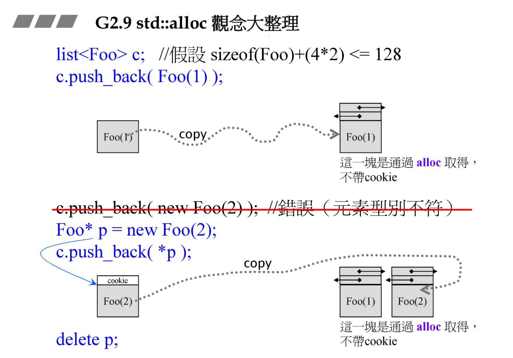


## 31 G4.9 pool_allocator


# 第三讲 malloc / free

## 32 VC6内存分配 VS VC10内存分配

#### SBH  small block heap


## 33~44 VC6 内存分配 malloc & free


### 如何理解

##### 前几次调用都是在计算整个管理空间所需要的 size-大小，`_sbh_alloc_block` 开始在真正分配空间。

##### size 计算
###### 1 进入 debug malloc模式 or malloc
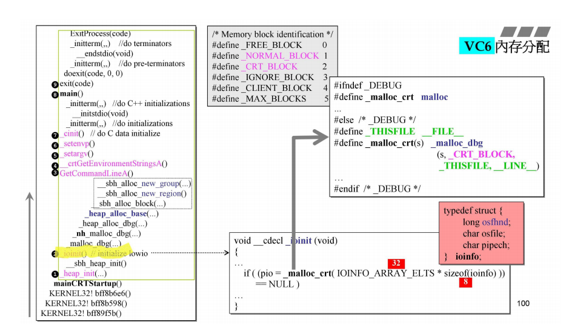

###### 2 对应1 nsize + debug（信息+无人区0xfdfdfdfd）（32+4=36字节）
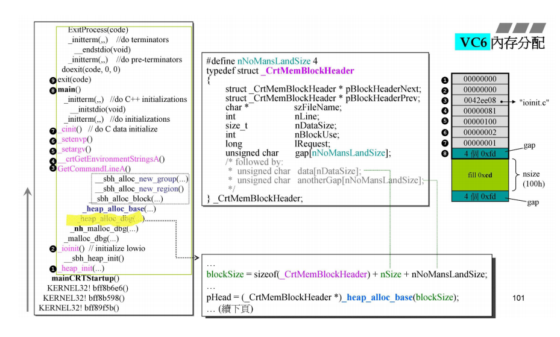

###### 3 nsize + debug + cookie（2*4）+padding（对齐16倍数）
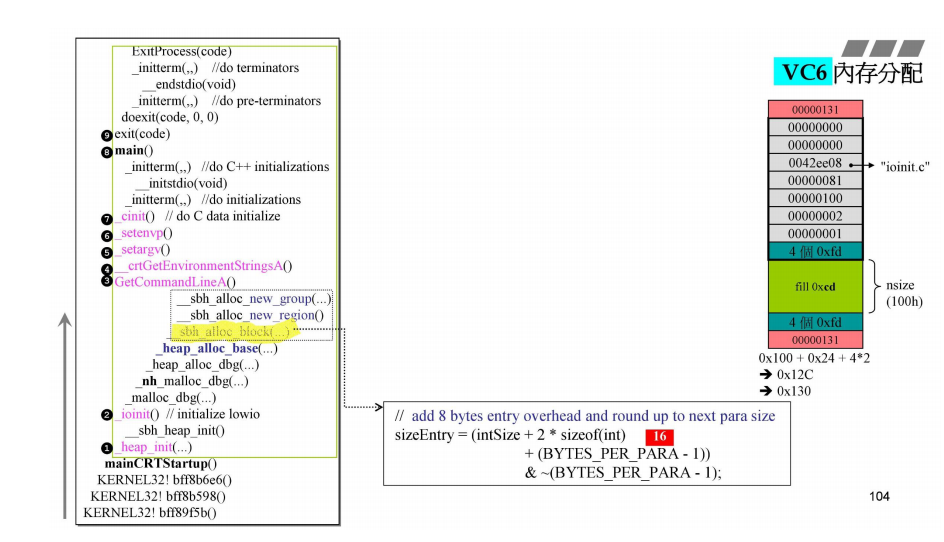

###### 这里有两张之前的图，可以对应上：debug模式 & 非debug模式，new & new[] ， new[]多四个字节记录几个
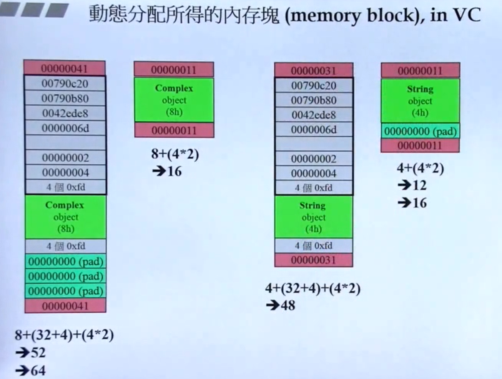

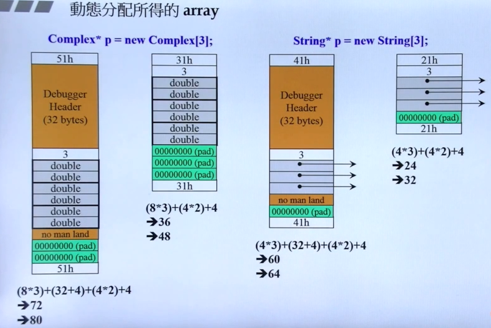


#### 1 管理内存所需要的数据结构


- 16 个 header，每个 header 管理 1Mb
- 1 个 header 两个指针，一根指针 指向 虚地址空间，一根指针 指向 1个 region
- 1 个 region 包含 32个 group 和 32*64的数组。32 个 group 管理 1Mb ，1 个 group 管理 32 kb
- 1个 group 包含 1个 cntEntries 和 64个 双指针，是一个 counter，malloc +1，free -1。 cntEntries=0 表示全回收
- 1个 group 32k，分为 8个 page，1个page是4k
- 64个双指针，分别管理 16字节 32字节 64字节 ... ... 1008字节 大于等于1024字节，当每一个page是大于 1k时，则挂在64组双指针的最后一组双指针上，构成 `循环双向链表` ，如下图

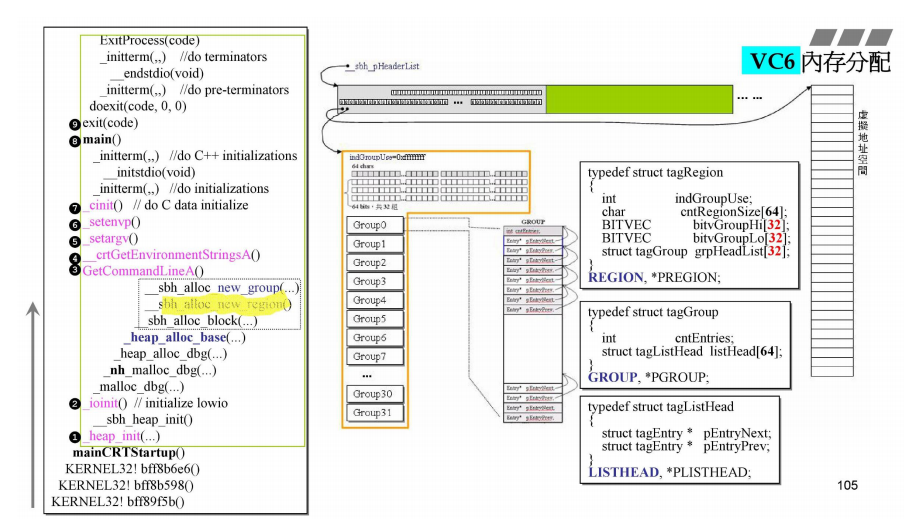

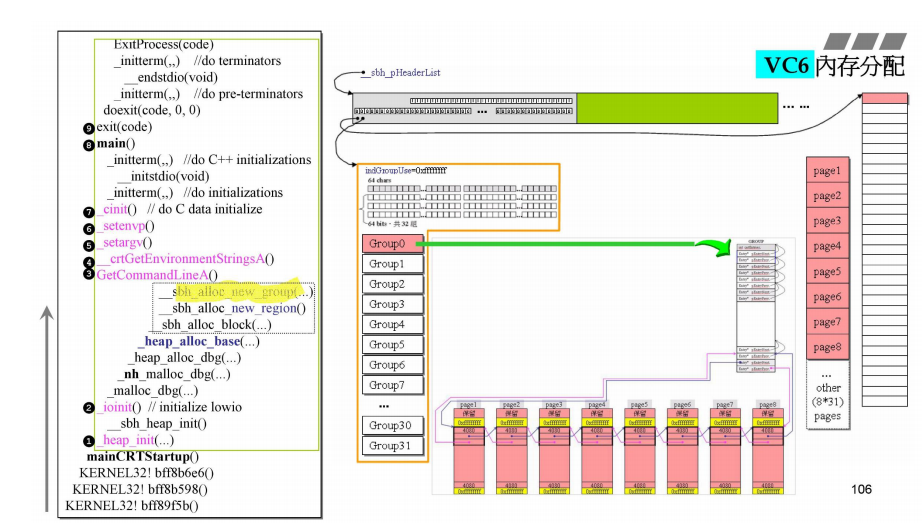

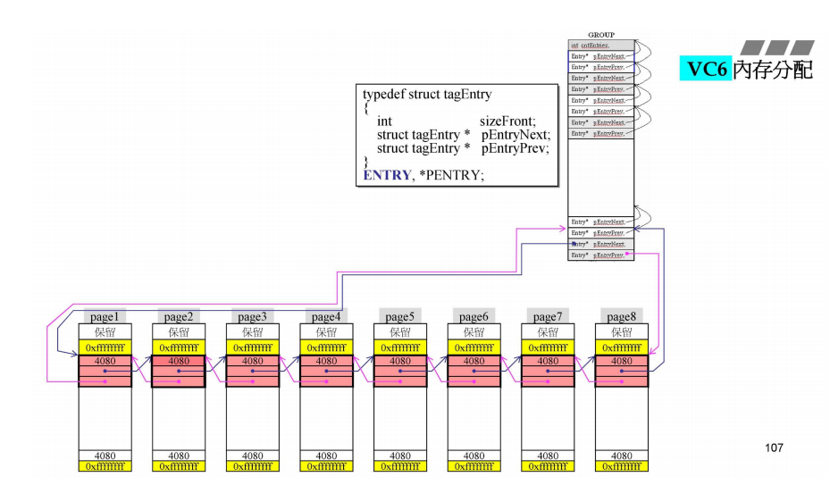


#### 2 如何 malloc
###### header ---> region ---> “由左到右，由上至下”查32*64数组
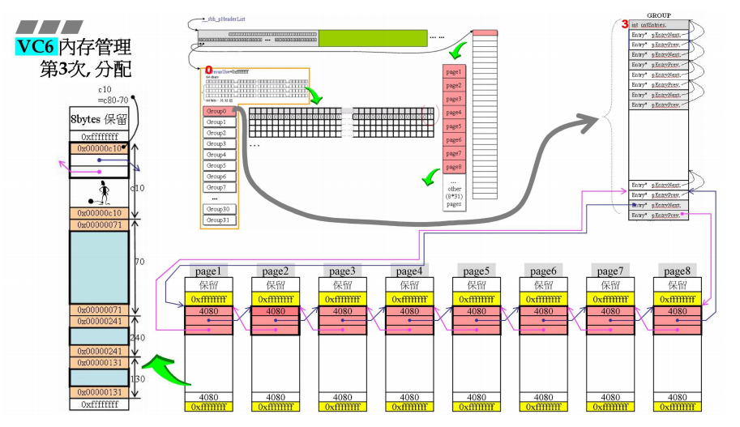

#### 3 如何 free
###### 确定 free 的指针 指向哪块内存
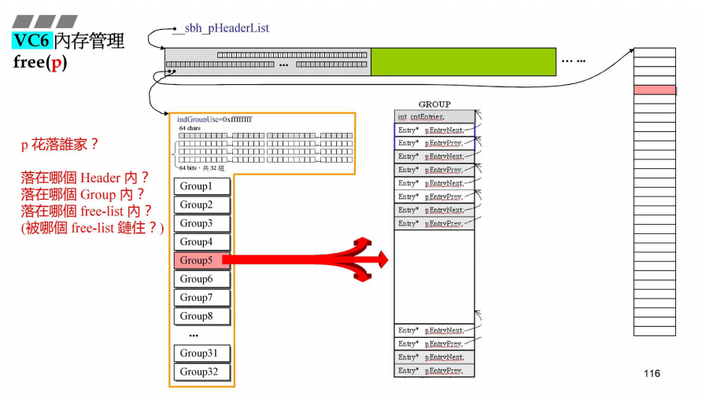

###### 是否需要合并，合并与否都要针对性 改变指针指向
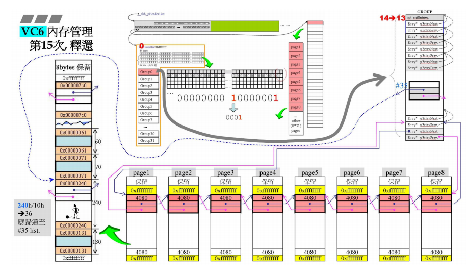


#### 上下cookie的作用
- 始终记录整个区块的大小
- 利于 `free` 时进行 `区块合并` 

`区块合并` ：如下，当中间的 300 内存被 free 时，考虑上下区块是否有 内存块 可以合并。考虑上区块，找到上区块的下cookie，查看最后一个字节是否为0，合并；考虑到下区块，找到下区块的上cookie，查看最后一个字节是否为0，合并。
合并时，当检测到有0xffffffff（-1）时，属于逻辑上的两个块，不执行“合并”
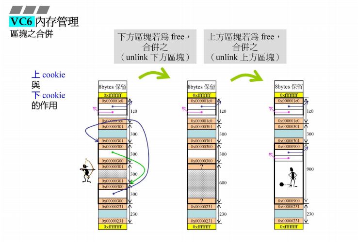


#### q：如何确定 counter 全回收
#### a：malloc一次，对于group的 counter+1； free一次，对应group的 counter-1。因为 free 的 内存块 肯定是之前 malloc 出去的内存块，所以不存在 free 的是任意大小内存的问题，当 `counter=0` 满足时，这时就是一个 `全回收` 。


#### 全回收的处理：
###### 管理平台手中尽可能留有一个全回收，当在此来全回收时，前者 还给 OS ，后者接着被管理，当 malloc出去的内存块属于手中的全回收时，全回收被分配出去，下图有说明。
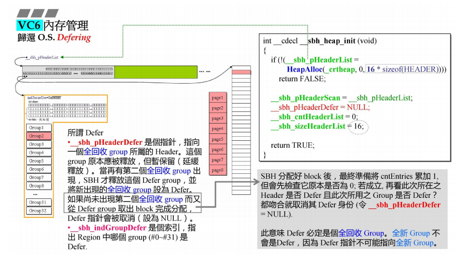


## *malloc & free 的实现肯定是先于 GNUC std中的alloc，管理分配得到的内存空间，设计管理方面都有异曲同工之妙*
- **G2.9中的stl中 alloc 管理的 16 根指针。**
- **VC6 管理的 32组指针，其中任意一组指针在功能上 与 G2.9 alloc 中 16根指针 异曲同工之妙**


#### q：叠层架构的必要性
#### a：OS层面，CRT（C RUN Time）层面，C++ std层面，都有内存的设计管理，作为跨平台语言，你并不知道底层的实现，不能过多依靠底层的实现，但这么做确实也是一种冗余。例如，VC 后面的设计已经跳过 CRT 层面，直接利用 windows 底层的 API。毕竟 VC 也是微软为 windows 写的c编译器，别人知道底层是个什么情况。
#### a：malloc&free管理很好，G2.9的stl的alloc主要是去除cookie，减少cookie对内存的占用。侯老师是上述这样说的，但好像也减少了debug和padding

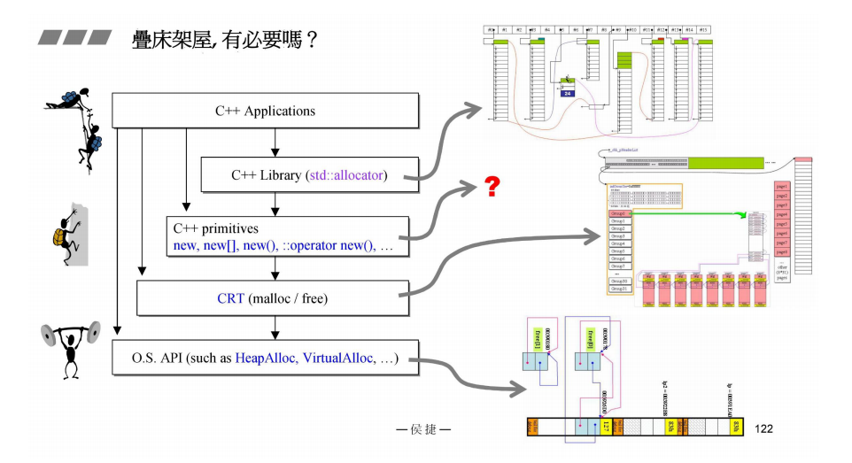


# 第四讲 loki::allocator

## 对比G2.9 alloc ，loki::allocator可以归还给OS

## 45~49 

#### 总结
- 有回收给内存的机制
- 索引代替指针
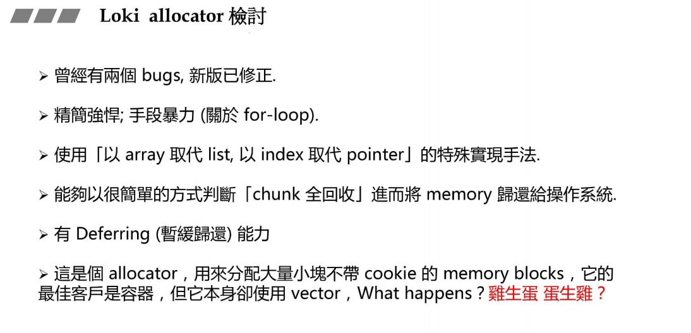

#### 看看后续实现一个，以这个allocator设计容器


#### 1 注意一下：a[-1] = *(a-1) ， a[b] = *(a+b)

#### 2 这段代码的漏洞应该是：右边的第一个 `if` 里面，将vector中最后一个的 delete之后，没有将当前已经全回收这个元素移动到vector的尾部，所以造成以后的全回收无法回收，并不断累积，除非尾部的位置是全回收。

#### 3 改动如下
```c++
if (lastChunk.blocksAvailable_ == numBlocks) {
    // 两个free chunks，抛弃最后一个
    lastChunk.Release();
    chunks_.pop_back();
    allocChunk_ = deallocChunk_;
}

// 将当前全回收放置尾部
std::swap(*deallocChunk_, lastChunk);
allocChunk_ = &chunks_.back();
```
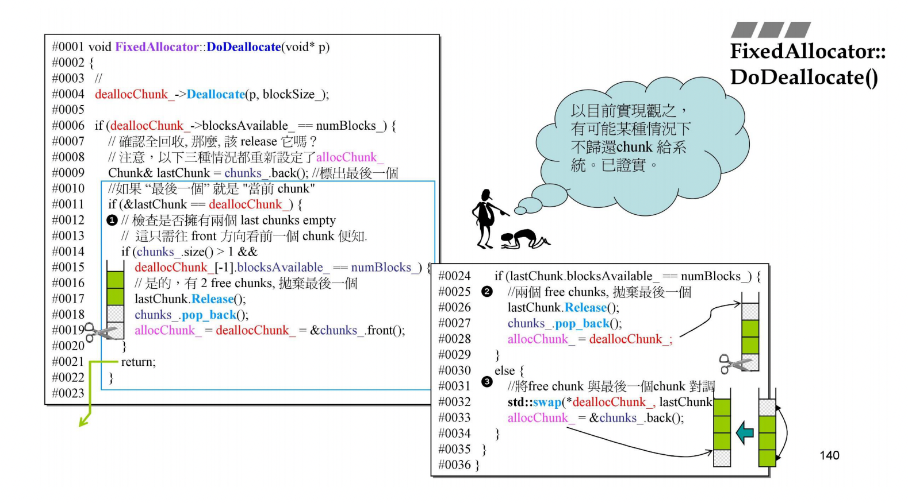


# 第五讲 other issues GNUC 下面 其他分配器

## 50 GNU C++ 官方 对于 allocator的描述
## 51 VC2013 GNUC 中 “阳春”的分配器
## 52 array_allocator
## 53 debug_allocator
## 54 55 bitmap_allocator


